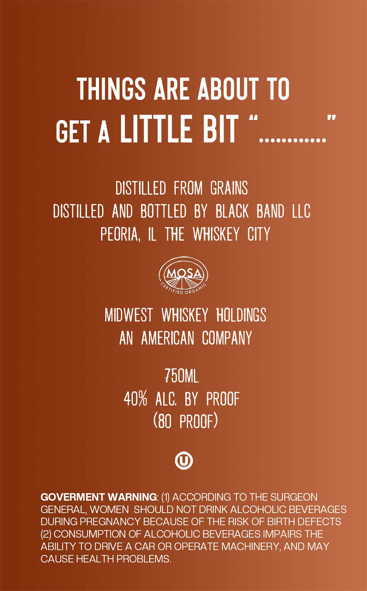
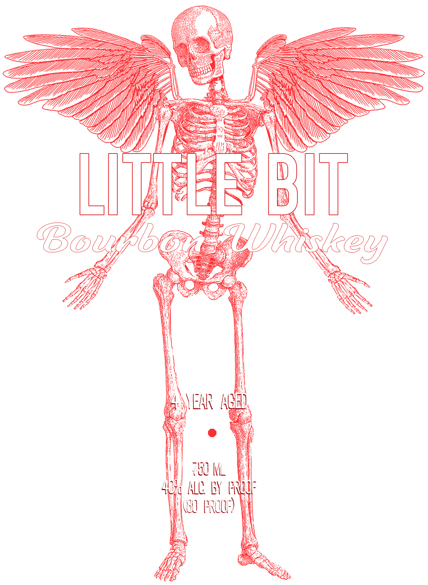

# TTB COLA Label Images - TTBID 26037001000726

**Brand Name:** LITTLE BIT

**Issue Date:** 02/20/2026

**Origin Code:** 04

**Product Class/Type:** 141

**Source:** [TTB Public COLA Registry](https://ttbonline.gov/colasonline/viewColaDetails.do?action=publicFormDisplay&ttbid=26037001000726)

## Label Images

### Back Label

### Front Label

## Extracted Label Text

*Text extracted via OCR - may contain errors*

### Back Label

THINGS ARE ABOUT TO

vy

GET A LITTLE BIT ©

DISTILLED FROM GRAINS

DISTILLED AND BOTTLED BY BLACK BAND LLC

PEORIA, IL THE WHISKEY CITY

&&®

MIDWEST WiSKEY HOLDINGS

AN AMERICAN COMPANY

TOOML

40% ALC. BY PROOF

(80 PROOF)

©

GOVERMENT WARNING: (1) ACCORDING TO THE SURGEON

GENERAL, WOMEN SHOULD NOT DRINK ALCOHOLIC BEVERAGES

DURING PREGNANCY BECAUSE OF THE RISK OF BIRTH DEFECTS

ABILITY TO DRIVE A CAR OR OPERATE MACHINERY, AND MAY

(2) CONSUMPTION OF ALCOHOLIC BEVERAGES IMPAIRS THE

CAUSE HEALTH PROBLEMS.

### Front Label

Ss

—

SS

yy

=—

Yj

BZ

em

Wy

YZ

SS

AW

pl

\

IWS

ff

u

y

\(

\

\

4s

\S

a

N

LN

=

4Lf

mss

Bowe

UPS:

eg

Lp

|

i

NEAR |

\

Wy

HO AL

|

if

oh

|

al

Lt BY FAW!

-\ hy

-

)

| (0 PRO

|
