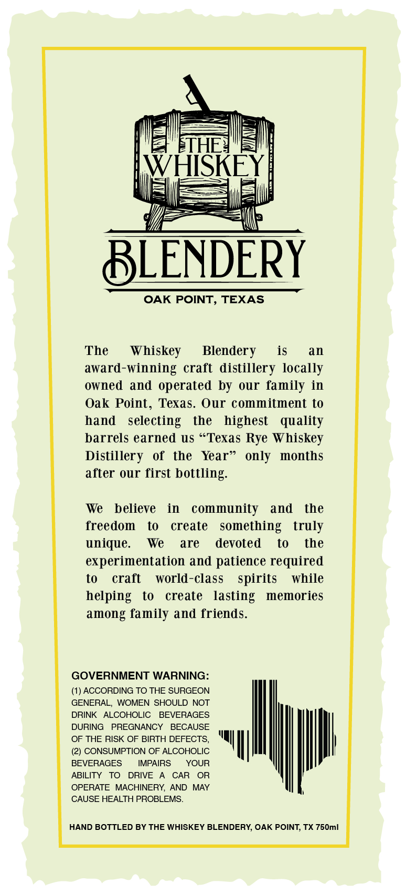
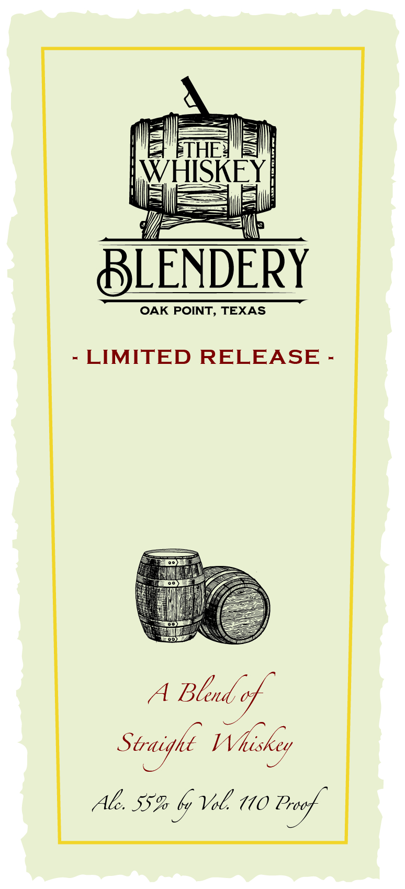

# TTB COLA Label Images - TTBID 26038001000022

**Brand Name:** THE WHISKEY BLENDERY

**Issue Date:** 02/11/2026

**Origin Code:** 44

**Product Class/Type:** 129

**Source:** [TTB Public COLA Registry](https://ttbonline.gov/colasonline/viewColaDetails.do?action=publicFormDisplay&ttbid=26038001000022)

## Label Images

### Back Label

### Front Label

## Extracted Label Text

*Text extracted via OCR - may contain errors*

### Back Label

_————=]

Ee

FI

ul

a

SS

=

(

l

is

\t

WN

{

|

\

i

BLENDERY

——————————————

OAK POINT, TEXAS

The

Whiskey

Blendery

is

an

award-winning craft distillery locally

owned and operated by our family in

Oak Point, Texas. Our commitment to

hand selecting the highest quality

barrels earned us “Texas Rye Whiskey

Distillery of the Year” only months

after our first bottling.

We believe in community and the

freedom to create something truly

unique.

We are

devoted

to

the

experimentation and patience required

to craft

world-class

while

spirits

helping to create lasting memories

among family and friends.

GOVERNMENT WARNING:

(1) ACCORDING TO THE SURGEON

GENERAL, WOMEN SHOULD NOT

DRINK ALCOHOLIC BEVERAGES

DURING PREGNANCY BECAUSE

OF THE RISK OF BIRTH DEFECTS,

(2) CONSUMPTION OF ALCOHOLIC

BEVERAGES

IMPAIRS

YOUR

ABILITY TO DRIVE A CAR OR

OPERATE MACHINERY, AND MAY

CAUSE HEALTH PROBLEMS.

«ly

HAND BOTTLED BY THE WHISKEY BLENDERY, OAK POINT, TX 750mI

### Front Label

————

a) =

= ||

eB

a

5

=]

al

——

hi

{<>

=|

i’

ALENDERY

OAK POINT, TEXAS

LIMITED RELEASE

A Bled

Sernighé Whiskey

Ale. 55% by Voll 100 Proof
