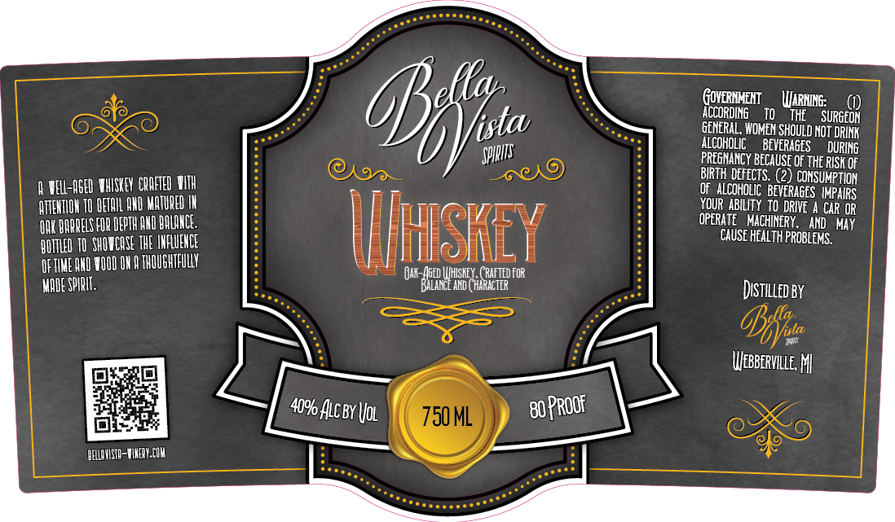

# TTB COLA Label Images - TTBID 26038001000029

**Brand Name:** BELLA VISTA SPIRITS

**Issue Date:** 02/10/2026

**Origin Code:** 06

**Product Class/Type:** 140

**Source:** [TTB Public COLA Registry](https://ttbonline.gov/colasonline/viewColaDetails.do?action=publicFormDisplay&ttbid=26038001000029)

## Label Images

### Label 1

## Extracted Label Text

*Text extracted via OCR - may contain errors*

### Label 1

ACCORDING TO THE SURGE

GENERAL, WOMEN SHOULD NOT DRINK

ALCOHOLIC BEVERAGES DURING

Alle

PREGNANCY BECAUSE OF THE RISK OF

() VEL-0GE0 WHISUEY CREED WITH

OF ALCOHOLIC BEVERAGES IMPAIRS

BIRTH DEFECTS. (2) CONSUMPTION

AUVENTION TO ETO QND MATURED IN

YOUR ABILITY TO DRIVE A CAR OR

(UM BARBELS FOR DEPTH AND ALAN.

CRE Y

OPERATE MACHINERY, AND MAY

OMTLED 10 SHOCASE THE INRUENEE

CAUSE HEALTH PROBLEMS.

Mii

L]

FTIME AND WOOD ON 8 THOUGHTFUL

i KD

i FOR

WADE SPI

LAN mi

Distuteo By

‘ae

WEBBERVILLE, Mf

Gael

BOPROO

ix

ELUUVISTR-WINERYCOM
