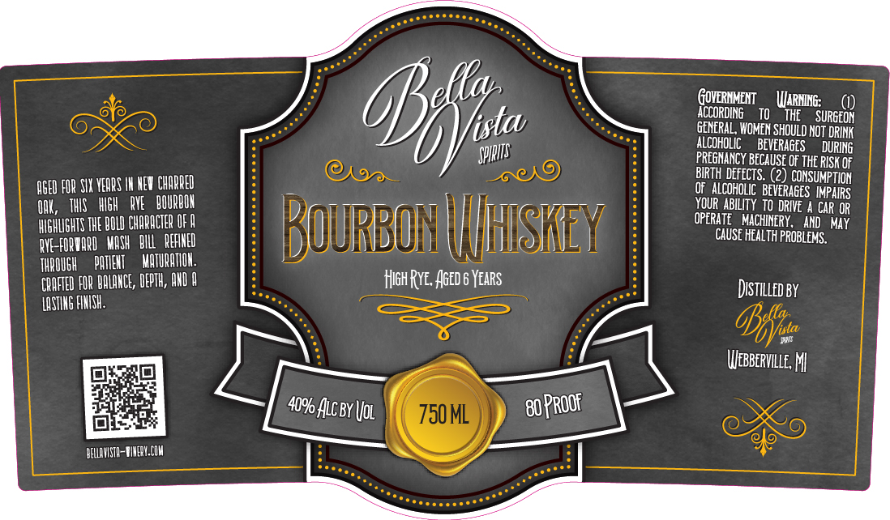

# TTB COLA Label Images - TTBID 26038001000030

**Brand Name:** BELLA VISTA SPIRITS

**Issue Date:** 02/12/2026

**Origin Code:** 06

**Product Class/Type:** 141

**Source:** [TTB Public COLA Registry](https://ttbonline.gov/colasonline/viewColaDetails.do?action=publicFormDisplay&ttbid=26038001000030)

## Label Images

### Label 1

## Extracted Label Text

*Text extracted via OCR - may contain errors*

### Label 1

ACCORDING 70 te SURG

GENERAL, WOMEN SHOULD NOT DRINK’

ALCOHOLIC BEVERAGES DURING

PREGNANCY BECAUSE OF THE RISK OF

GED FOR SI YEQRS I NEW CHAR

OF ALCOHOLIC BEVERAGES IMPAIRS

BIRTH DEFECTS. (2) CONSUMPTION

NG

THIS WiGH RYE

BOURBON

YOUR ABILITY TO DRIVE A CAR OR

HIGHLIGHTS THE BOLD CHARACTER OF 8

HISKE

OPERATE MACHINERY, AND MAY.

AVE-FORVORD ASH BILL REFINED

QURBO!

IHISK

CAUSE HEALTH PROBLEMS.

THROUGH PATIENT MATURATION

CQNFTED FOR BALANCE, DEPTH, AND A

Het ¢ i sts

DisTiLLeD By

LASTING FINISH,

AANISTO-UNEY.C
