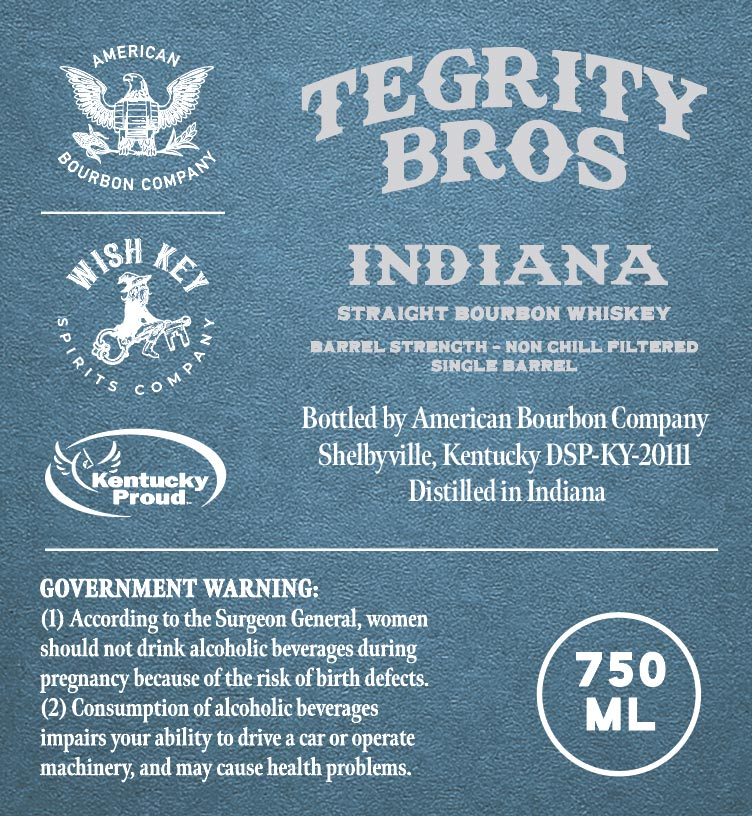
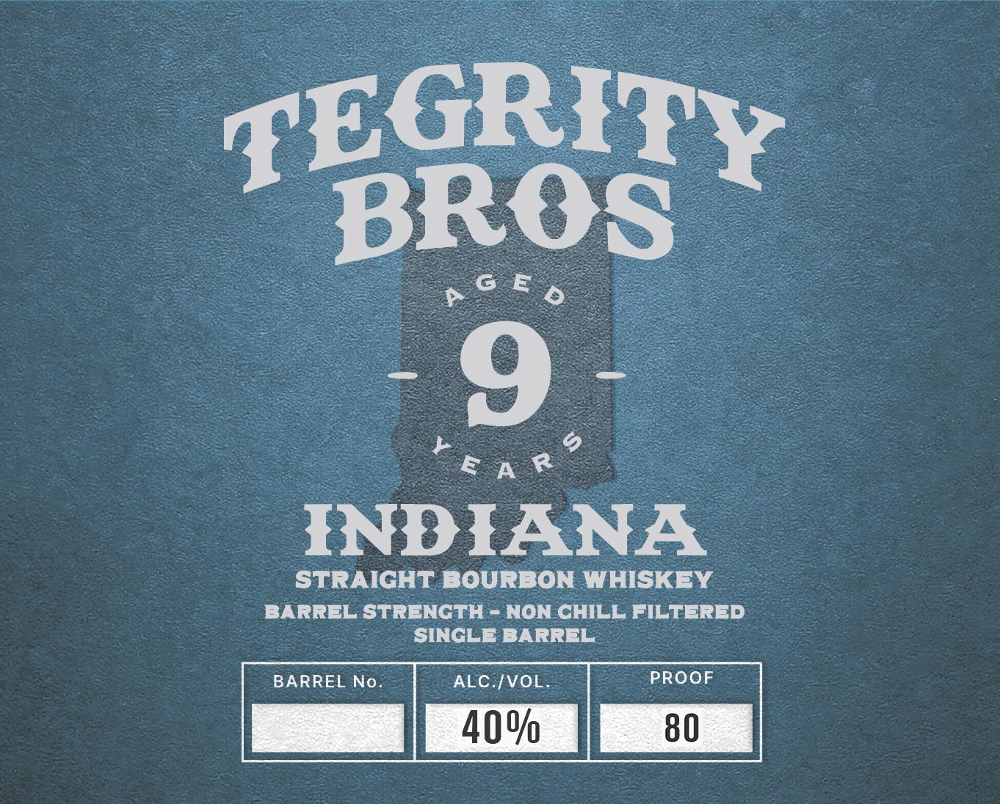

# TTB COLA Label Images - TTBID 26038001000072

**Brand Name:** TEGRITY BROS

**Issue Date:** 02/10/2026

**Origin Code:** 22

**Product Class/Type:** 101

**Source:** [TTB Public COLA Registry](https://ttbonline.gov/colasonline/viewColaDetails.do?action=publicFormDisplay&ttbid=26038001000072)

## Label Images

### Back Label

### Front Label

## Extracted Label Text

*Text extracted via OCR - may contain errors*

### Back Label

pMER CAN

pe

Rif

YReON COMP

OS

DIANA

ll t

ST

IGHT BOURBON WHISKEY

BARREL STREN

NON CHILL FILTERED

= BARREL

rs CON

‘Bottled by American Bourbon Company

Stelle Kentucky DSP-KY-20111

- Distilled in Indiana

Proud.

GOVERNMENT WARNING:

(1) According to the Surgeon General, women

should not drink alcoholic beverages during

pregnancy because of the risk of birth defects.

(2) Consumption of alcoholic beverages

impairs your ability to drive a car or operate

machinery, and may cause health problems.

### Front Label

2 Cs o
STRAIGHT BOURBON WHISKEY _
BARREL STRENGTH - NON CHILL FILTERED
_ SINGLE BARREL
BARREL No. |  ALC./VOL. PROOF
| 40% 80
