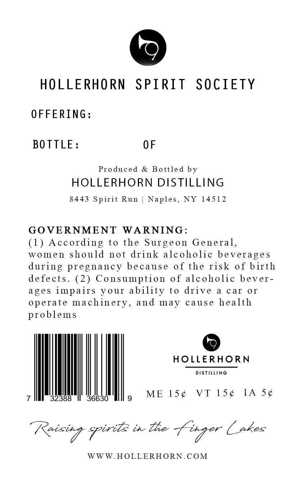
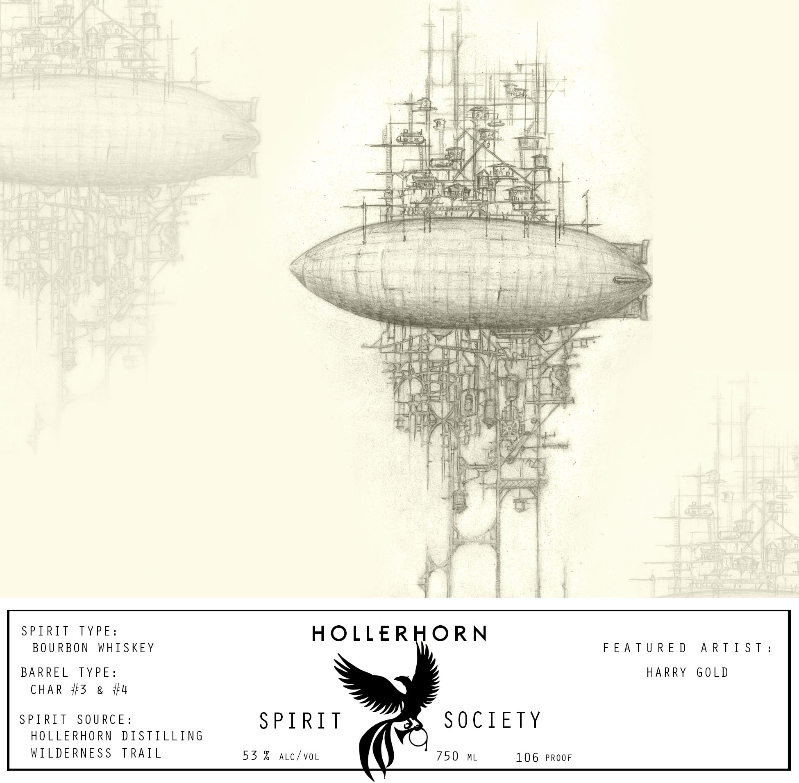
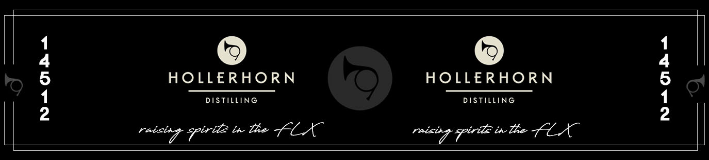

# TTB COLA Label Images - TTBID 26039001000034

**Brand Name:** HOLLERHORN DISTILLING

**Fanciful Name:** HOLLERHORN SPIRIT SOCIETY

**Issue Date:** 02/10/2026

**Origin Code:** 02

**Product Class/Type:** 141

**Source:** [TTB Public COLA Registry](https://ttbonline.gov/colasonline/viewColaDetails.do?action=publicFormDisplay&ttbid=26039001000034)

## Label Images

### Back Label

### Front Label

### Label 2

## Extracted Label Text

*Text extracted via OCR - may contain errors*

### Back Label

HOLLERHORN SPIRIT SOCIETY

OFFERING:

BOTTLE:

OF

Produced & Bottled by

HOLLERHORN DISTILLING

8443 Spirit Run | Naples, NY 14512

GOVERNMENT WARNING:

(1) According to the Surgeon General,

women should not drink alcoholic beverages

during pregnancy because of the risk of birth

defects. (2) Consumption of alcoholic bever-

ages impairs your ability to drive a car or

operate machinery, and may

ause health

problems

©

HOLLERHORN

DISTILLING

ME 15¢

VT 1S¢

IA 5¢

wn

WWW.HOLLERHORN.COM

### Front Label

uj

il

|

Bi,

|

&

Pot

y ieee | oe

dei

i?

Sr

id

rn

a4

By,

AC)

=,

a

he

Raat

je:

tid

aN

Ley

8g

he

ge

é

NEL}

se

ee:

ipl

pili

7

ie

bis

<j

any

a

i

AIR

Tete

MG

2

1G

4

g tals

ei

a

i

d

ir

|

|

i

SPIRIT

YP Es

HOLLERHORN

BOURBO

WHISKEY

FEATURED ARTIST:

BARREL

YPE:

HARRY GOLD

CHAR #3 & #4

SPIRIT SOURCE:

SPIRIT

SOCIETY

HOLLERHORN DISTILLING

WILDERNESS TRAIL

53% atc/vor

750 mL

106 PROOF

### Label 2

©

©

HOLLERHORN

HOLLERHORN

DISTILLING

DISTILLING

ineioep pir tl in The LEX
