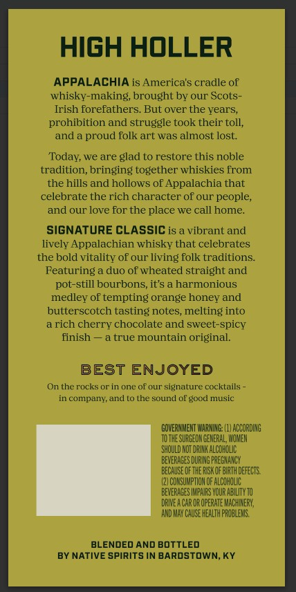
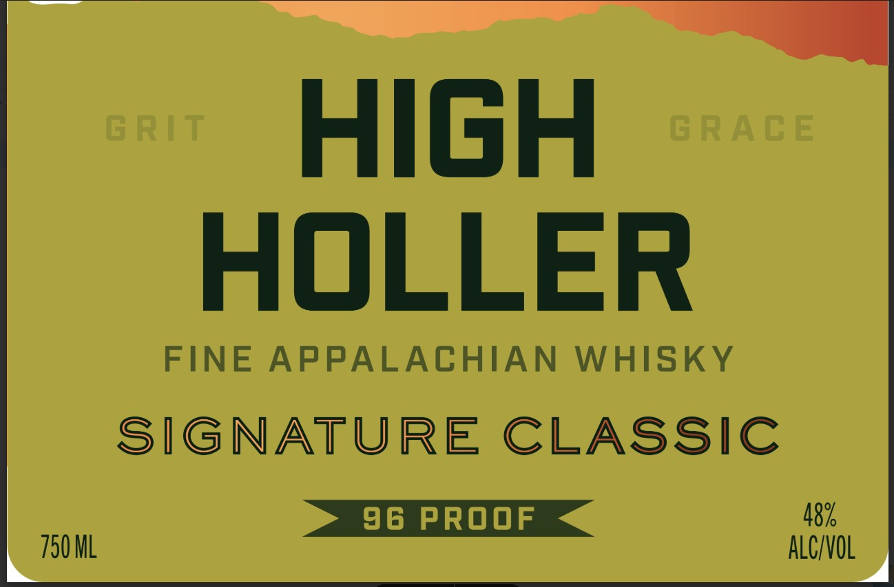

# TTB COLA Label Images - TTBID 26040001000140

**Brand Name:** HIGH HOLLER

**Issue Date:** 02/11/2026

**Origin Code:** 22

**Product Class/Type:** 140

**Source:** [TTB Public COLA Registry](https://ttbonline.gov/colasonline/viewColaDetails.do?action=publicFormDisplay&ttbid=26040001000140)

## Label Images

### Back Label

### Front Label

## Extracted Label Text

*Text extracted via OCR - may contain errors*

### Back Label

HIGH HOLLER

APPALACHIA is Ameri

's cradle of

whisky-making, brought by our Scots-

Irish forefathers. But over the years,

prohibition and struggle took their toll,

and a proud folk art was almost lost.

‘Today, we are glad to restore this noble

tradition, bringing together whis

from

the hills and hollows of Appalachia that

celebrate the rich character of our people,

and our love for the place we call home.

SIGNATURE CLASSIC is a vibrant and

lively Appalachian whisky that celebrates

the bold vitality of our |

ing folk traditions.

Featuring a duo of wheated straight and

pot-still bourbons, it’s a harmonious

medley of tempting orange honey and

butterscotch tasting notes, melting into

arich cherry chocolate and sweet-spicy

finish — a true mountain original.

BEST ENJOYED

On the rocks or in one of our signature cocktails -

in company, and to the sound of good music

OVERNMENT WARNIN: (1) OCORDING

TOTHESURGEON GENERAL, WOMEN

SHOULD NOT DRINK ALCOHOLIC

‘BEVERAGES DURING PREGNANCY.

BEGMISE OFTHE RK OF BATH DEFECTS.

(2) OONSUMPTION OF ALOOHOUC

BEVERAGES MPA YOUR ALITY 10

DRIEA CAR OR OPERATE MACHINERY,

AND MAY CAUSE HEALTH PROBLEMS.

BLENDED AND BOTTLED

BY NATIVE SPIRITS IN BARDSTOWN, KY

### Front Label

HIGH
HOLLER

FINE APPALACHIAN WHISKY
SIGNATURE CLASSIC
8

ALC/VOL
