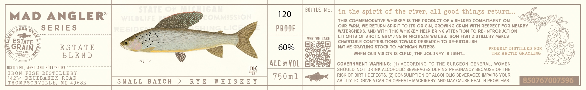

# TTB COLA Label Images - TTBID 26040001000165

**Brand Name:** MAD ANGLER

**Issue Date:** 02/12/2026

**Origin Code:** 06

**Product Class/Type:** 142

**Source:** [TTB Public COLA Registry](https://ttbonline.gov/colasonline/viewColaDetails.do?action=publicFormDisplay&ttbid=26040001000165)

## Label Images

### Label 1

## Extracted Label Text

*Text extracted via OCR - may contain errors*

### Label 1

MAD ANGLER’
SERIES

ESTATE
BLEND

DISTILLED, ASED AND BOTTLED BY:~
IRON FISH DISTILLERY
14234 DZUIBANEK ROAD
THOMPSONVILLE, MI 4968

cRgune

SMALL BATCH

RYE WHISKEY

BOTTLE No.

ALC ey VOL

WHY WE CARE

750m1

in the spirit of the river, all good things return...

THIS COMMEMORATIVE WHISKEY IS THE PRODUCT OF A SHARED COMMITMENT. ON

OUR FARM, WE RETURN SPIRIT TO ITS ORIGIN, GROWING GRAIN WITH RESPECT FOR NEARBY
WATERSHEDS, AND WITH THIS WHISKEY HELP BRING ATTENTION TO RE-INTRODUCTION
EFFORTS OF ARCTIC GRAYLING IN MICHIGAN WATERS. IRON FISH DISTILLERY MAKES.
CHARITABLE CONTRIBUTIONS TOWARD RESEARCH TO RE-ESTABLISH

NATIVE GRAYLING STOCK TO MICHIGAN WATERS. PROUDLY DISTILLED FOR

WHEN OUR VISION IS CLEAR, THE JOURNEY IS LIGHT... THE ARCTIC GRAYLING

GOVERNMENT WARNING: (1) ACCORDING TO THE SURGEON GENERAL, WOMEN
SHOULD NOT DRINK ALCOHOLIC BEVERAGES DURING PREGNANCY BECAUSE OF THE
RISK OF BIRTH DEFECTS. (2) CONSUMPTION OF ALCOHOLIC BEVERAGES IMPAIRS YOUR
ABILITY TO DRIVE A CAR OR OPERATE MACHINERY, AND MAY CAUSE HEALTH PROBLEMS.

Ee
