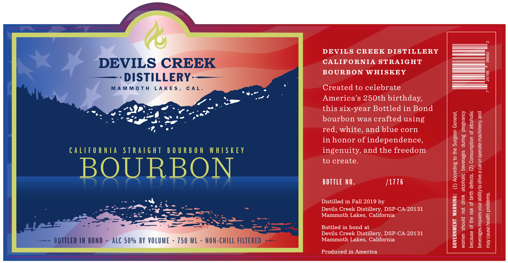
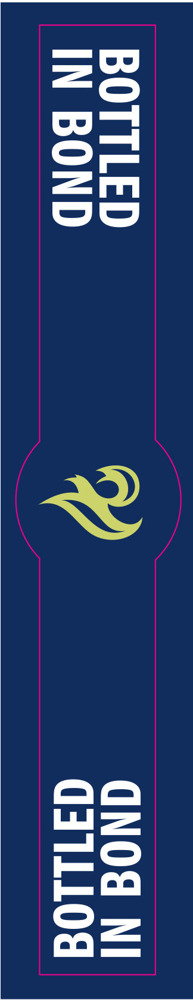

# TTB COLA Label Images - TTBID 26040001000176

**Brand Name:** DEVILS CREEK DISTILLERY

**Issue Date:** 02/11/2026

**Origin Code:** 01

**Product Class/Type:** 119

**Source:** [TTB Public COLA Registry](https://ttbonline.gov/colasonline/viewColaDetails.do?action=publicFormDisplay&ttbid=26040001000176)

## Label Images

### Label 1

### Label 2

## Extracted Label Text

*Text extracted via OCR - may contain errors*

### Label 1

DEVILS CREEK DISTILLERY

_——————————

DEVILS CREE.

CALIFORNIA STRAIGHT

BOURBON WHISKEY

———

- DISTILLERY-——

MAMMOTH LAKES

CAL

Created to celebrate

. ed

wd

America’s 250th birthday,

ww

Jaan

oe

2-es

ao .

this six-year Bottled in Bond

ee

- “LP, -

aon

of

reZs

ey Y

wD bw

bourbon was crafted using

9,

red, white, and blue corn

in honor of independence

CALIFORNIA STRAIGHT BOURBON WHISKEY

ingenuity, and the freedom

to create

BOURBON

BOTTLE NO

/1176

mY

Distilled in Fall 2019 by

fee

v= a

ee. vo

——

Devils Creek Distillery, DSP-CA-20131

age

Peg 2

—_— &

Mammoth Lakes, California

=a —

~— we.

—) ——a——

Bottled in bond at

Devils Creek Distillery, DSP-CA-20131

ALC 50% BY VOLUME -

750 ML -

NON-CHI

Tl

Mammoth Lakes, California

Produced in America

### Label 2

w=

—FKri

— =|

[= =)

Lid ==

j= OO
