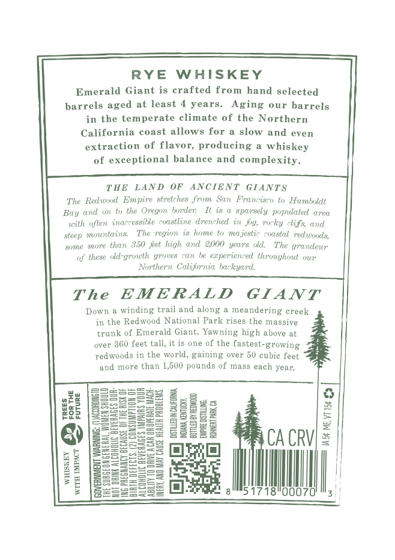
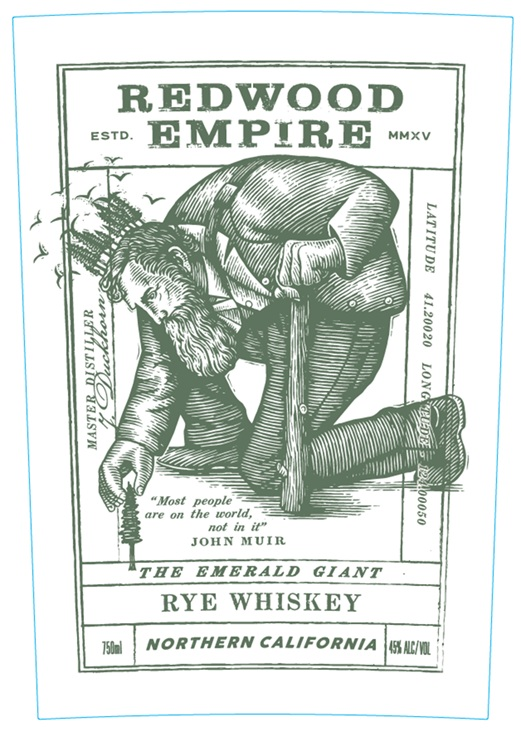
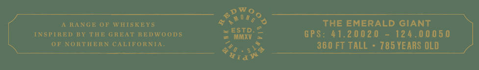

# TTB COLA Label Images - TTBID 26040001000265

**Brand Name:** REDWOOD EMPIRE

**Fanciful Name:** THE EMERALD GIANT

**Issue Date:** 02/11/2026

**Origin Code:** 01

**Product Class/Type:** 142

**Source:** [TTB Public COLA Registry](https://ttbonline.gov/colasonline/viewColaDetails.do?action=publicFormDisplay&ttbid=26040001000265)

## Label Images

### Back Label

### Front Label

### Label 3

## Extracted Label Text

*Text extracted via OCR - may contain errors*

### Back Label

RYE WHISKEY
Emerald Giant is crafted from hand selected
barrels aged at least 4 years. Aging our barrels
in the temperate climate of the Northern
California coast allows for a slow and even
extraction of flavor, producing a whiskey
of exceptional balance and complexity.

THE LAND OF ANCIENT GIANTS
The Redwood Empire stretches from San Francisco to Humboldt
Bay and on to the Oregon borden It is @ sparsely populated area
with often inaccessile coastline drenched in jog, rocky clife, and
steep mununtains, The region is home to majestic coastal redwoods,
‘some more than 350 fet high and 2000 years old. The grandeur
of these old-growth groves can be experienced throughout our

Northern California backyard.

The EMERALD GIANT

Down a winding trail and along a meandering creek
in the Redwood National Park rises the massive
trank of Emerald Giant. Yawning high above at
over 360 feet tall, it is one of the fastest-growing
redwoods in the world, gaining over 50 cubie feet
and more than 1,500 pounds of mass each year.

Q) |gezeeee: 2EEE2 CACRVI =
SE SE MIT |
2 wl
*E |Bcceeegs al alls 1718!000701!5|)

### Front Label

REDWOOD

JOHN MUIR

PIRE wo

NOT 0zoozIy ganLrLyT

THE EMERALD GIANT

RYE WHISKEY

mI
i

Wl | NORTHERN CALIFORNIA |guin

### Label 3

Wo
RA = = :
A RANGE OF WHISKEYS at tes ___ THE EMERALD GIANT _
INSPIRED BY THE GREAT REDWOODS Pee GPS: 41.20020 - 124.00050
OP NORTHERN CALIFORNIA. es * 360 FT TALL - 785 YEARS OLD
O50 - 8m ee Ano ULU
trav
