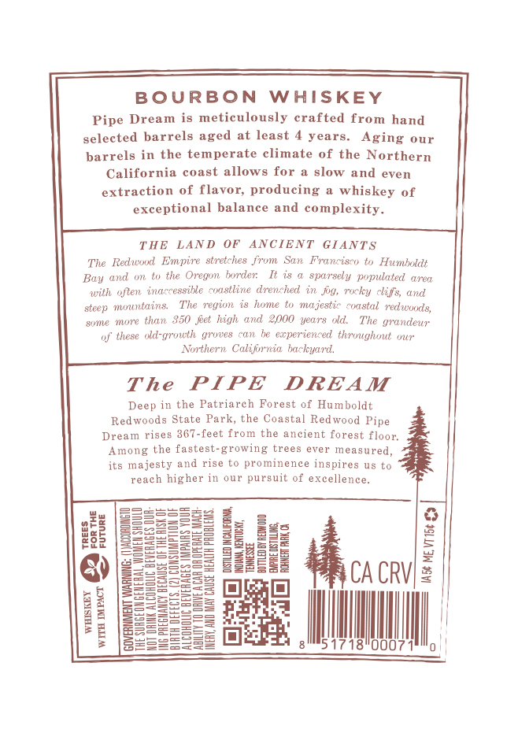
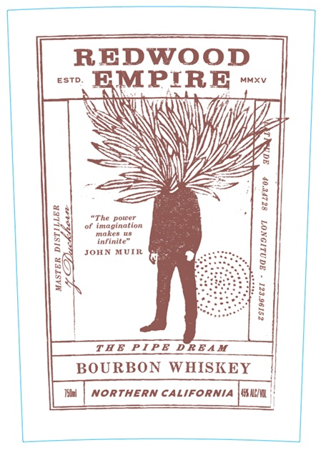
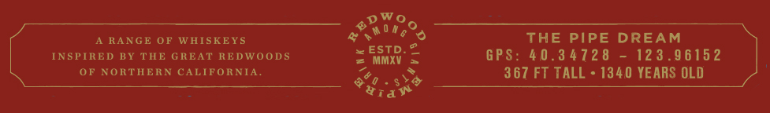

# TTB COLA Label Images - TTBID 26040001000271

**Brand Name:** REDWOOD EMPIRE

**Fanciful Name:** THE PIPE DREAM

**Issue Date:** 02/10/2026

**Origin Code:** 01

**Product Class/Type:** 141

**Source:** [TTB Public COLA Registry](https://ttbonline.gov/colasonline/viewColaDetails.do?action=publicFormDisplay&ttbid=26040001000271)

## Label Images

### Back Label

### Front Label

### Label 3

## Extracted Label Text

*Text extracted via OCR - may contain errors*

### Back Label

BOURBON WHISKEY

Pipe Dream is meticulously crafted from hand

selected barrels aged at least 4 years. Aging our

;

barrels in the temperate cl

ate of the Northern

California coast allows for a slow and even

extraction of flavor, producing a whiskey of

exceptional balance and complexity.

THE LAND OF ANCIENT GIANTS

The Redwood Empire stretches from San Franciseo to Humboldt

h

border It is a sparsely populated area

Bay and om to the Oregon

with often inaccessible coastline drenched in fig, rocky clifs, and

steep mountains,

The region is home to majestic coastal redwoods,

‘some more than 350 fet high and 2000 years old. The grandeur

of these old-growth groves can be experienced throughout our

Northern Colifwnia backyard.

The PIPE DREAM

Deep in the Patriarch Forest of Humboldt

Redwoods State Park, the Coastal Redwood Pipe

Dream rises 367-feet from the ancient forest floor.

‘Among the fastest-growing trees ever measured,

its majesty and rise to prominence inspires us to

reach higher in our pursuit of excellence.

esses:

ze

Yu

Besase=

SSSac

=

= 2

o

ae

See

ae

ee

=

95

Se)

Ses

2

eae

SECS

SS S25=

SSSSss

a

S|

gee

Ft

=

2

zeeasS

SSnSc55

g

z

Ba

@)

==

Ze25:

Sa2S8

CA CRV

SSS sss

SsEseos

SSSSES2

Ser ees

SEStssS

SSS

ee

=

BESSs

i

jaeeesee

=

ll

BESS

SSeelee

===

ul

00071

|

2

0

### Front Label

REDWOOD
MPIRE ~»

SS
SS

4)

THE PIPE DREAM
BOURBON WHISKEY |
Tal

| NORTHERN CALIFORNIA ||!

### Label 3

A RANGE OF WHISKEYS

sone 20

THE PIPE DREAM

INSPIRED BY THE GREAT REDWOODS

“este. 2

= MMXV

GPS: 40.34728 - 123.96152

OF NORTHERN CALIFORNIA

“she

367 FT TALL - 1340 YEARS OLD

&e

wa
