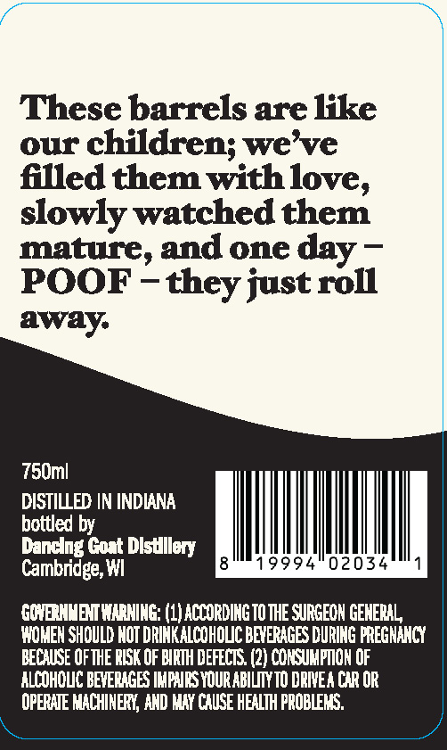
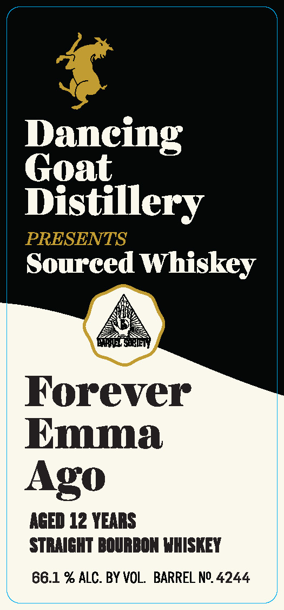

# TTB COLA Label Images - TTBID 26040001000404

**Brand Name:** DANCING GOAT DISTILLERY PRESENTS

**Fanciful Name:** FOREVER EMMA AGO

**Issue Date:** 02/11/2026

**Origin Code:** 48

**Product Class/Type:** 101

**Source:** [TTB Public COLA Registry](https://ttbonline.gov/colasonline/viewColaDetails.do?action=publicFormDisplay&ttbid=26040001000404)

## Label Images

### Back Label

### Front Label

## Extracted Label Text

*Text extracted via OCR - may contain errors*

### Back Label

These barrels are like
our children; we’ve
filled them with love,
slowly watched them
mature, and one day —
POOF - they just roll
away.

750ml

DISTILLED IN INDIANA

hottled by

Dancing Goat Distillery

Cambridge, WI 8 19994 02034 1
GOVERNWENT WARNING: 1} ACCORDING OTHE SURGEON GENERAL
WOMEN SHOULD NOT DRINK ALCOHOLIC BEFERAGES DURING PREGNANCY
BECAUSE OF THE RISK OF BIRTH DEFECTS. (2) CONSUMPTION OF
ALCOHOLIC BEVERAGES IMPAIRS YOUR ABILITY T0 DRIVEA CAR OR
OPERATE MACHINERY, AND MAY CAUSE HEALTH PROBLEMS.

### Front Label

Daneing

Goat

Distillery

Sourced Whiskey

Forever

Emma

Ago

AGED 12 YEARS

STRAIGHT BOURBON WHISKEY

66.1 % ALC. BY VOL. BARREL N°. 4244
