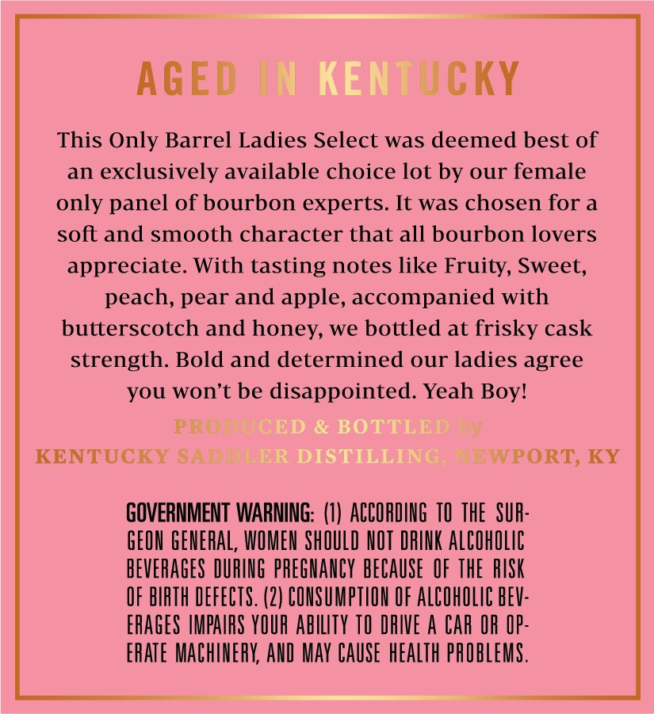

# TTB COLA Label Images - TTBID 26040001000465

**Brand Name:** SADDLER

**Issue Date:** 02/17/2026

**Origin Code:** 22

**Product Class/Type:** 101

**Source:** [TTB Public COLA Registry](https://ttbonline.gov/colasonline/viewColaDetails.do?action=publicFormDisplay&ttbid=26040001000465)

## Label Images

### Back Label

## Extracted Label Text

*Text extracted via OCR - may contain errors*

### Back Label

AGED

JCKY

This Only Barrel Ladies Select was deemed best of

an exclusively available choice lot by our female

only panel of bourbon experts. It was chosen for a

soft and smooth character that all bourbon lovers

appreciate. With tasting notes like Fruity, Sweet,

peach, pear and apple, accompanied with

butterscotch and honey, we bottled at frisky cask

strength. Bold and determined our ladies agree

you won't be disappointed. Yeah Boy!

I

KENTUCKY

WPORT, KY

GOVERNMENT WARNING: (1) ACCORDING 10 THE SUA

GEON GENERAL, WOMEN SHOULD NOT DRINK ALCOHOLIC

BEVERAGES DURING PREGNANCY BECAUSE OF THE RISK

OF BIRTH DEFECTS. (2) CONSUMPTION OF ALCOHOLIC BEV

ERAGES IMPAIRS YOUR ABILITY TO DRIVE A CAR OR OP

ERATE MACHINERY, AND MAY CAUSE HEALTH PROBLEMS
