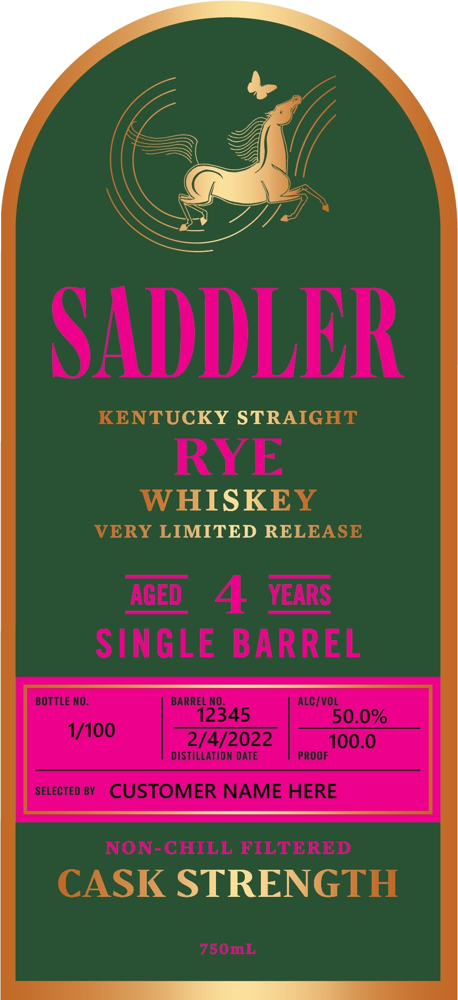
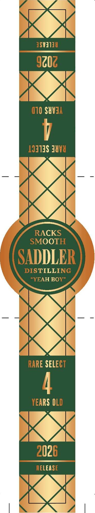

# TTB COLA Label Images - TTBID 26040001000476

**Brand Name:** SADDLER

**Issue Date:** 02/17/2026

**Origin Code:** 22

**Product Class/Type:** 102

**Source:** [TTB Public COLA Registry](https://ttbonline.gov/colasonline/viewColaDetails.do?action=publicFormDisplay&ttbid=26040001000476)

## Label Images

### Front Label

### Label 3

## Extracted Label Text

*Text extracted via OCR - may contain errors*

### Front Label

SADDLER

NTUCKY STRAIG

RYE

HISKE

tRY LIMITED RELEA

AGED 4 YEARS
SINGLE BARREL

BOTTLE NO. BARREL NO. ALC/VOL

12345 50.0%
ome 2/4/2022 |" 100.0

DISTILLATION DATE

sevecteo By CUSTOMER NAME HERE

NON-CHILL FILTERED

\SK STRENG

### Label 3

XK

9¢0¢

<x

(10 SU¥3A

107138 Tuva

RACKS

SADDLER

MOOTH

DISTILLING

x

RARE SELECT

TEARS OLD

LY Sy

WA,

2026

ELEA 8

| =

KX

ym |
