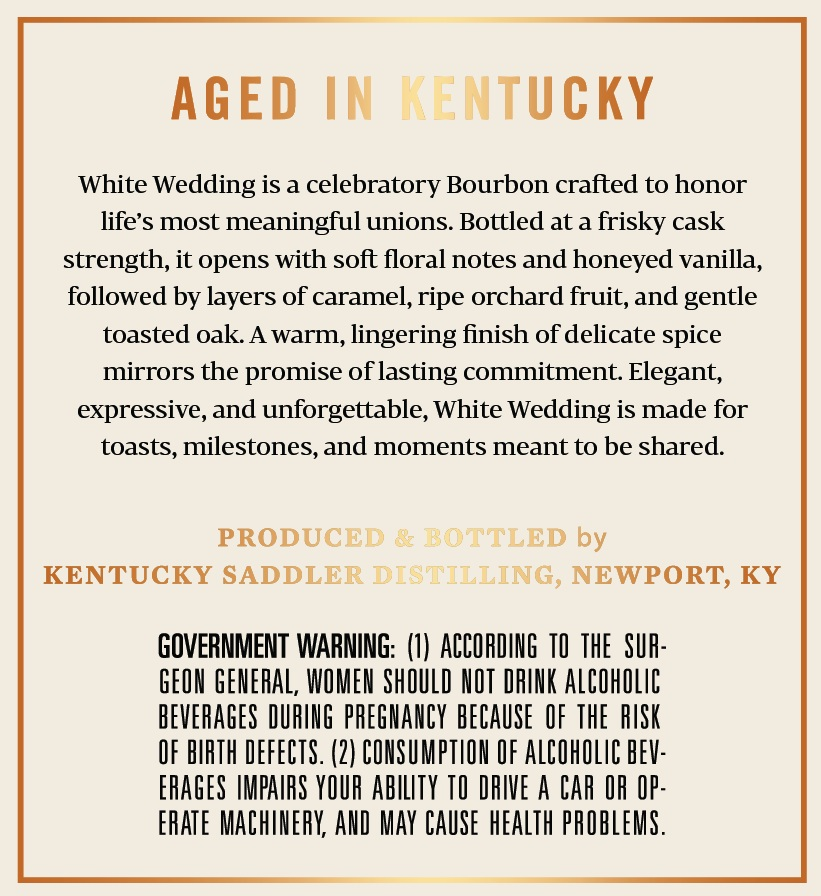

# TTB COLA Label Images - TTBID 26040001000482

**Brand Name:** SADDLER

**Issue Date:** 02/17/2026

**Origin Code:** 22

**Product Class/Type:** 102

**Source:** [TTB Public COLA Registry](https://ttbonline.gov/colasonline/viewColaDetails.do?action=publicFormDisplay&ttbid=26040001000482)

## Label Images

### Back Label

### Front Label

### Label 3

## Extracted Label Text

*Text extracted via OCR - may contain errors*

### Back Label

AGED IN

\TUCKY

White Wedding is a celebratory Bourbon crafted to honor

life’s most meaningful unions. Bottled at a frisky cask

strength, it opens with soft floral notes and honeyed vanilla.

followed by layers of caramel, ripe orchard fruit, and gentle

toasted oak. A warm, lingering finish of delicate spice

mirrors the promise of lasting commitment. Elegant,

expressive, and unforgettable, White Wedding is made for

toasts, milestones, and moments meant to be shared.

PRODU(

) by

KENTUCKY SADDLI

NEWPORT, KY

GOVERNMENT WARNING: (1) ACCORDING T0 THE SUR

GEON GENERAL, WOMEN SHOULD NOT DRINK ALCOHOLIC

BEVERAGES DURING PREGNANCY BECAUSE OF THE RISK

OF BIRTH DEFECTS. (2) CONSUMPTION OF ALCOHOLIC BEV:

ERAGES IMPAIRS YOUR ABILITY TO DRIVE A CAR Of OP

ERATE MACHINERY, AND MAY CAUSE HEALTH PROBLEMS

### Front Label

/

&

SADDLER

KENTUC!

RAIGHT

RYE

WH!

cEY

VERY LIM!

<ELEASE

White Uolding

SINGLE BARREL SELECT

BOTTLE NO.

BARREL NO.

4

50.0%

1/100

DISTILLATION DATE

2/4/2022

P

100.0

setecteD BY CUSTOMER NAME HERE

NON-CHILL FILTERED

CASK S'

NGTH

750mL

### Label 3

~/)

a

asyinid

9202

4

UUTBLELY

]

1913) a

SM

RA

SAD

D

1

q

RARE

EST

YER

it}

Ys

|

RELLASE

2026

S|

NK

Zi
