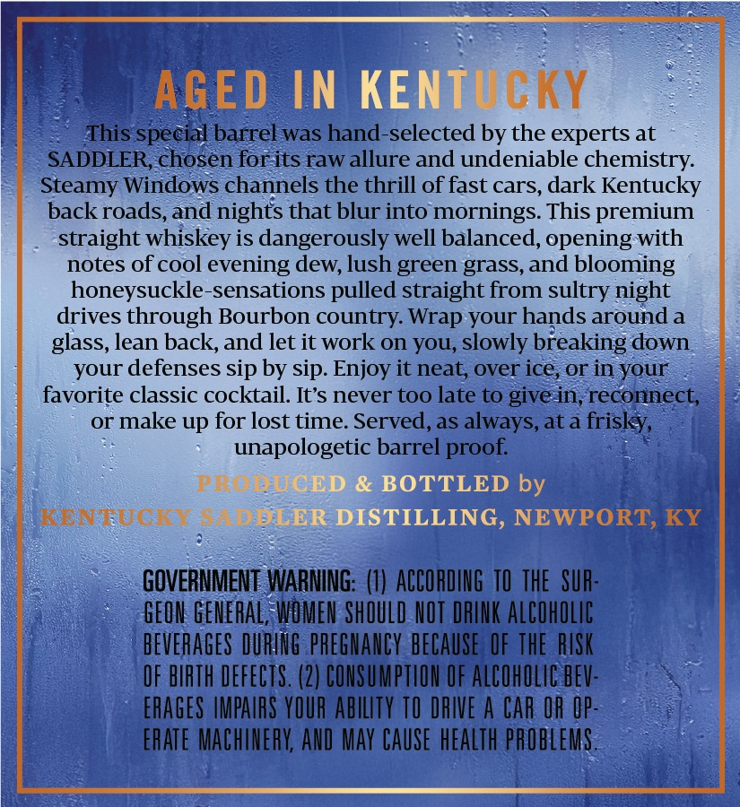
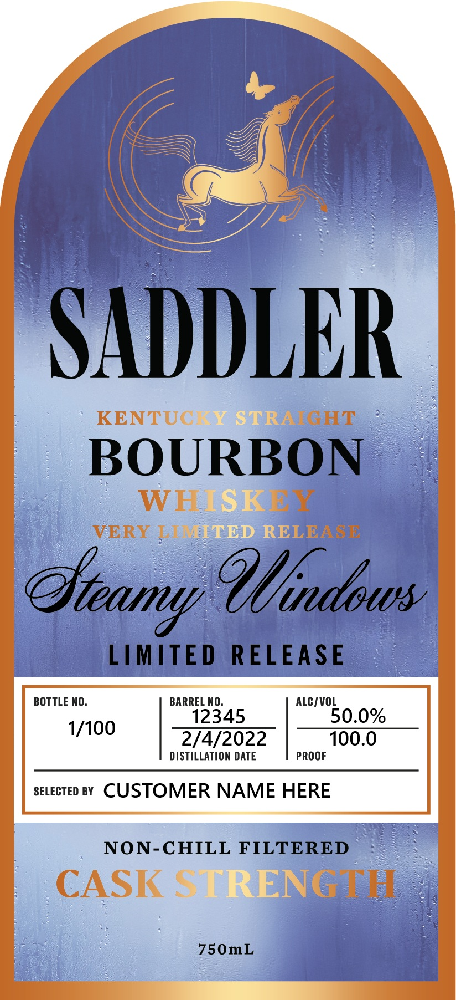

# TTB COLA Label Images - TTBID 26040001000487

**Brand Name:** SADDLER

**Issue Date:** 02/17/2026

**Origin Code:** 22

**Product Class/Type:** 101

**Source:** [TTB Public COLA Registry](https://ttbonline.gov/colasonline/viewColaDetails.do?action=publicFormDisplay&ttbid=26040001000487)

## Label Images

### Back Label

### Front Label

### Label 3

## Extracted Label Text

*Text extracted via OCR - may contain errors*

*1 image(s) excluded: text did not meet readability threshold*

### Back Label

AGED IN

KEN FP CKY

S spe

barrel was fe. selected by the experts at

SADDLER, Poisn forits raw allure and undeniable chemistry.

Steamy Windows channels the thrill of fast cars, dark Kentucky

back roads, and nights that blur into mornings. This premium

straight whiskey is dangerously well balanced, opening-with

notes of cool evening dew, lush green grass, and blooming

honeysuckle-sensations pulled straight from sultry night

drives through Bourbon country. Wrap your hands around a

glass, lean back, and let it work on you, slowly breaking down

your defenses sip by sip. Enjoy it neat, over ice, or in your

favorite classic cocktail. It’s never too late to givein, reconnect,

or make up for lost time. Served, as always, at a frisky,

wee barrel proof.

PRO:

D by

Be EUCKY S|

WPORT,

GOVERNMENT WARNING: (1) ACCORDING 10 THE SUR

GEON GENERAL, WOMEN SHOULD NOT DRINK ALCOHOLIC

BEVERAGES DURING PREGNANCY BECAUSE OF THE RISK

OF BIRTH DEFECTS. (2) CONSUMPTION OF ALCOHOLIC BEV

ERAGES IMPAIRS YOUR ABILITY TO DRIVE A CAR OR OF

ERATE MACHINERY, AND MAY CAUSE HEALTH PROBLEMS

—

—

sll

### Front Label

‘SADDLER

KENTUC) (EEE

BOURBON
wh @

VERY LE! 2 SELEAS

LIMITED RELEASE

BOTTLE NO. BARREL NO. mee 0%
. (0)
1/100 2/4/2022 700.0
DISTILLATION DATE PROOF

sevecteo BY CUSTOMER NAME HERE

NON-CHILL FILTERED

CASK © ING TE!

750mL
