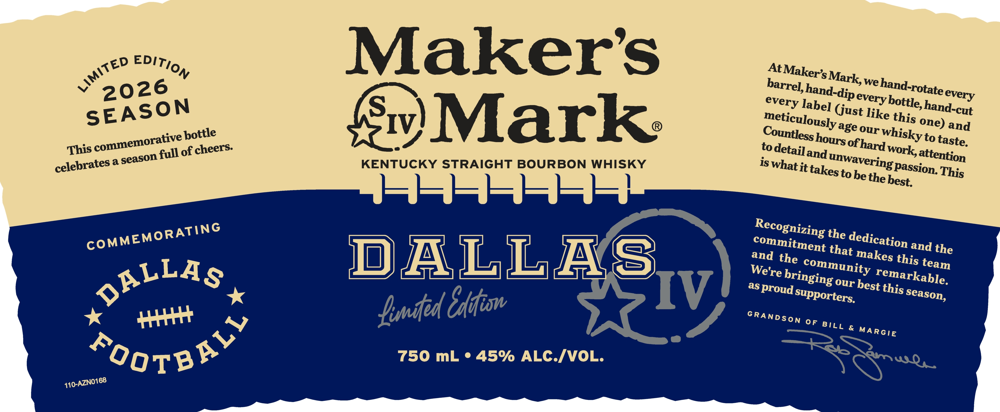
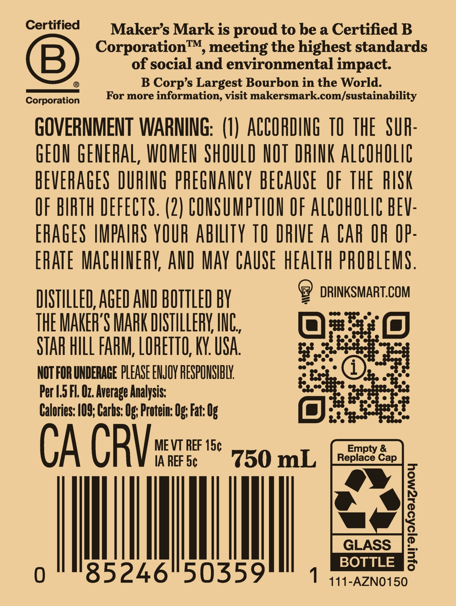

# TTB COLA Label Images - TTBID 26040001000532

**Brand Name:** MAKER'S MARK

**Issue Date:** 02/11/2026

**Origin Code:** 22

**Product Class/Type:** 101

**Source:** [TTB Public COLA Registry](https://ttbonline.gov/colasonline/viewColaDetails.do?action=publicFormDisplay&ttbid=26040001000532)

## Label Images

### Label 1

### Label 2

## Extracted Label Text

*Text extracted via OCR - may contain errors*

### Label 1

<€D EDIT),

Maker's

At Maker

‘arrel], h

k, we hand.

2026

tate every

every lab

P €Very bo; a

3 hand-cut

SEASON

Meticulo I

ust like this

IV

emorat!

ve hottle

Mark:

ge our Whisky

to taste

This comm

on full of cheers

is detail ang

attention

celebrates

aseas'

KENTUCKY STRAIGHT BOURBON WHISKY

18 What it takes tobe het ire This

€cCognizin

ATING

& the de.

°

Commitme

nt that m

Cation a

nd the

and

this tea

DALLA

S

We're 5

G Comm n

Ting)

is Our best

“markable

as pr ‘oud Supp

this Season

osttas

IV

famed Cif

Hert 4,

SRANDSon OF BILL & MARGIE

750 mL ° 45% ALC./VOL.

“oors®

440-AZNO168

### Label 2

Certified

Maker’s Mark is proud to be a Certified B

Corporation™, meeting the highest standards

of social and environmental impact

8

®

B Corp’s Largest Bourbon in the World.

Corporati

For more information, visit makersmark.com/sustainability

GOVERNMENT WARNING: (1) ACCORDING 10 THE SUR

GEON GENERAL, WOMEN SHOULD NOT DRINK ALCOHOLIC

BEVERAGES DURING PREGNANCY BECAUSE OF THE RISK

OF BIRTH DEFECTS. (2) CONSUMPTION OF ALCOHOLIC BEV

ERAGES IMPAIRS YOUR ABILITY TO DRIVE A CAR OR OP

ERATE MACHINERY, AND MAY CAUSE HEALTH PROBLEMS

- DRINKSMART.COM

DISTILLED, AGED AND BOTTLED BY

THE MAKER'S MARK DISTILLERY, INC

STAR HILL FARM, LORETTO, KY. USA

Fee

NOT FOR UNDERAGE PLEASE ENJOY RESPONSIBLY.

Per 1.5 Fl. Oz. Average Analysis:

Calories: 109; Carhs: Og; Protein: Og; Fat: 0

ae

CA CRY

MEVT REF 15¢

IA REF 5¢

750 mL

|

|

Ml

BOTTLE

1 111-AZN0150
