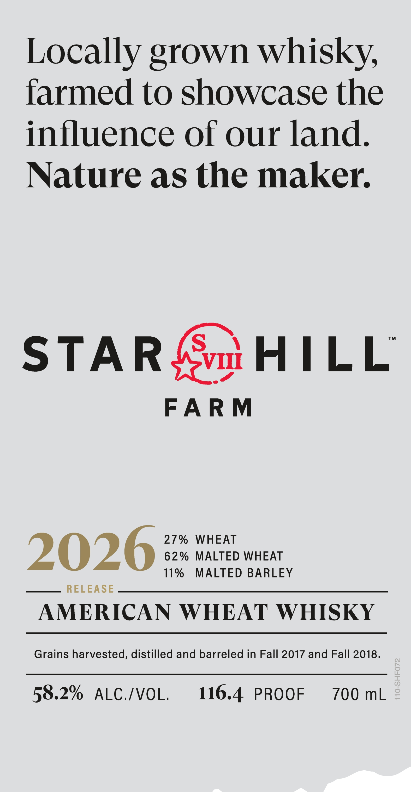
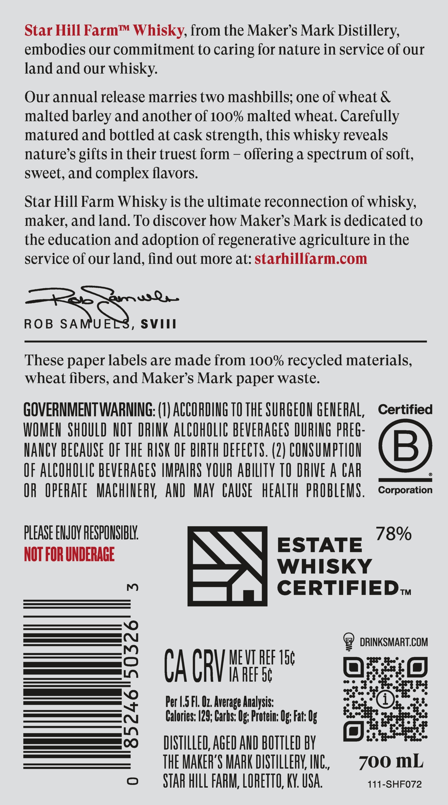
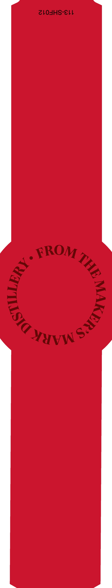

# TTB COLA Label Images - TTBID 26040001000537

**Brand Name:** STAR HILL FARM

**Issue Date:** 02/11/2026

**Origin Code:** 22

**Product Class/Type:** 140

**Source:** [TTB Public COLA Registry](https://ttbonline.gov/colasonline/viewColaDetails.do?action=publicFormDisplay&ttbid=26040001000537)

## Label Images

### Label 1

### Label 2

### Label 3

### Label 4

## Extracted Label Text

*Text extracted via OCR - may contain errors*

*2 image(s) excluded: text did not meet readability threshold*

### Label 1

Locally grown whisky,

farmed to showcase the

influence of our land

Nature as the maker

STAR

vo HILL

FARM

27% WHEAT

2026

62% MALTED WHEAT

— —— RELEASE

11% MALTED BARLEY

AMERICAN WHEAT WHISKY

Grains harvested, distilled and barreled in Fall 2017 and Fall 2018

58.2% ALC./VOL

116.4. PROOF

700 mL

### Label 2

Star Hill Farm™ Whisky, from the Maker’s Mark Distillery,

embodies our commitment to caring for nature in service of our

land and our whisky.

Our annual release marries two mashbills; one of wheat &

malted barley and another of 100% malted wheat. Carefully

matured and bottled at cask strength, this whisky reveals

nature’s gifts in their truest form — offering a spectrum of soft,

sweet, and complex flavors.

Star Hill Farm Whisky is the ultimate reconnection of whisky,

maker, and land. To discover how Maker’s Mark is dedicated to

the education and adoption of regenerative agriculture in the

service of our land, find out more at: starhillfarm.com

ws Qa.

, SVITII

These paper labels are made from 100% recycled materials,

wheat fibers, and Maker’s Mark paper waste.

GOVERNMENT WARNING: (1) ACCORDING 10 THE SURGEON GENERAL

Certified

WOMEN SHOULD NOT DRINK ALCOHOLIC BEVERAGES DURING PREG

NANCY BECAUSE OF THE RISK OF BIRTH DEFECTS. (2) CONSUMPTION

OF ALCOHOLIC BEVERAGES IMPAIRS YOUR ABILITY 10 DRIVE A CAR

©

Corporation

QR OPERATE MACHINERY, AND MAY CAUSE HEALTH PROBLEMS

PLEASE ENJOY RESPONSIBLY.

78%

NOT FOR UNDERAGE

QAA

ESTATE

WHISKY

—{ .) CERTIFIED.

es

MEV REF 1¢

@ DRINKSMART.COM

|)

CACR

IA REF O¢

e

10)

__ CONG)

og of

Ege

Per 1.5 Fl. Oz. Average Analysis:

Fg,se

40)

3.3

Calories: 129; Carbs: Og: Protein: Og: Fat: Og

_—___________[ve}

DISTILLED, AGED AND BOTTLED BY

2°,

THE MAKER'S MARK DISTILLERY, INC.,

700 mL

111-SHF072

STAR HILL FARM, LORETO, KY. USA.
