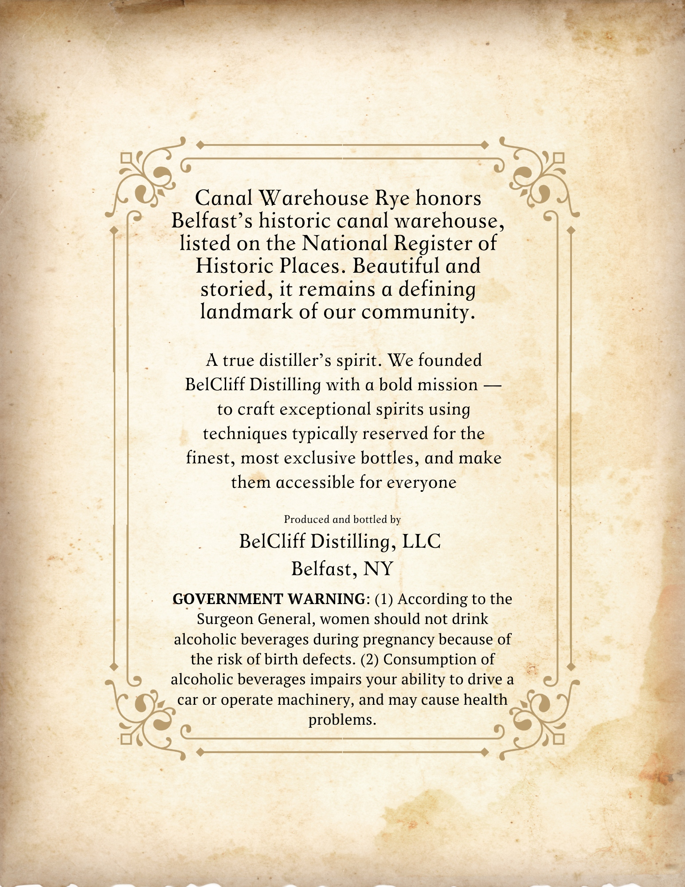
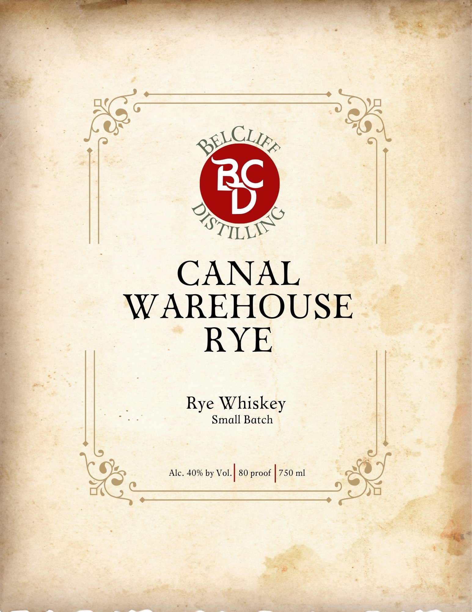

# TTB COLA Label Images - TTBID 26040001000635

**Brand Name:** CANAL WAREHOUSE RYE

**Issue Date:** 02/11/2026

**Origin Code:** 02

**Product Class/Type:** 142

**Source:** [TTB Public COLA Registry](https://ttbonline.gov/colasonline/viewColaDetails.do?action=publicFormDisplay&ttbid=26040001000635)

## Label Images

### Back Label

### Front Label

## Extracted Label Text

*Text extracted via OCR - may contain errors*

### Back Label

oo

Canal Warehouse Rye honors
Praia s historic canal warehouse,
listed on the National Register of
Historic Places. Beautiful and
storied, it remains a defining
landmark of our community.

. : A true distiller’s spirit. We founded
BelCliff Distilling with a bold mission —
to craft exceptional spirits using
techniques typically reserved for the
finest, most exclusive bottles, and make
them accessible for everyone

Produced and bottled by

BelCliff Distilling, LLC
Belfast, NY

GOVERNMENT WARNING: (1) According to the
Surgeon General, women should not drink
alcoholic beverages during pregnancy because of ©

the risk of birth defects. (2) Consumption of = =_——
alcoholic beverages impairs your ability to drive a

ss

problems

Gee tind ee Se

### Front Label

ao

sy

A

a

=

ie eae

ST SY

a

rs

CANAL

is

WAREHOUSE ©

RYE

ag

os

Rye Whiskey

Small Batch

Alc. 40% by Vol

80 proof

750 ml

&

ie

ae

es

nage

Ree

Age

Fuate

ie ptt ME

+
