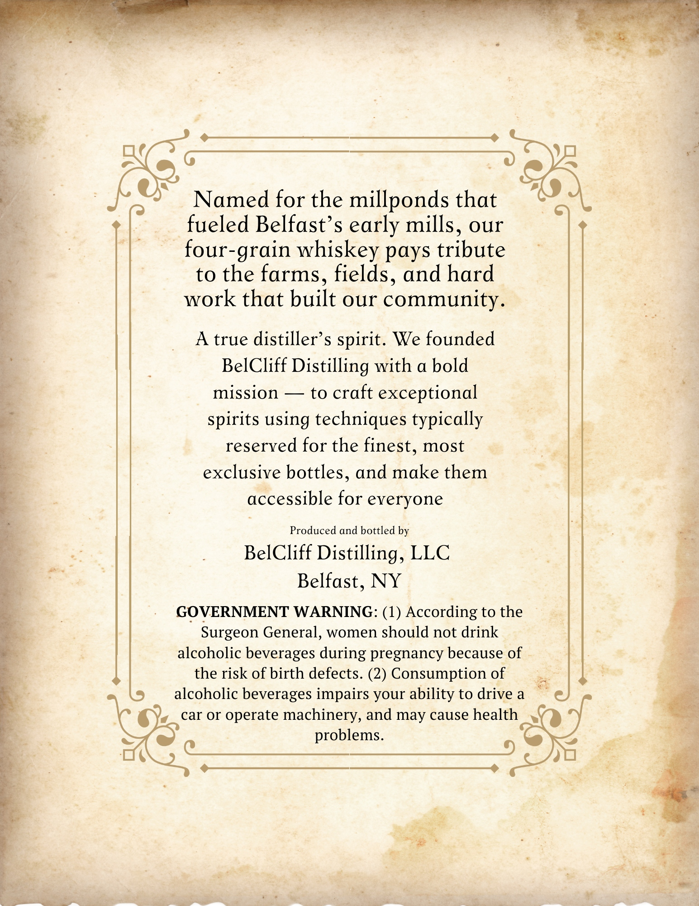
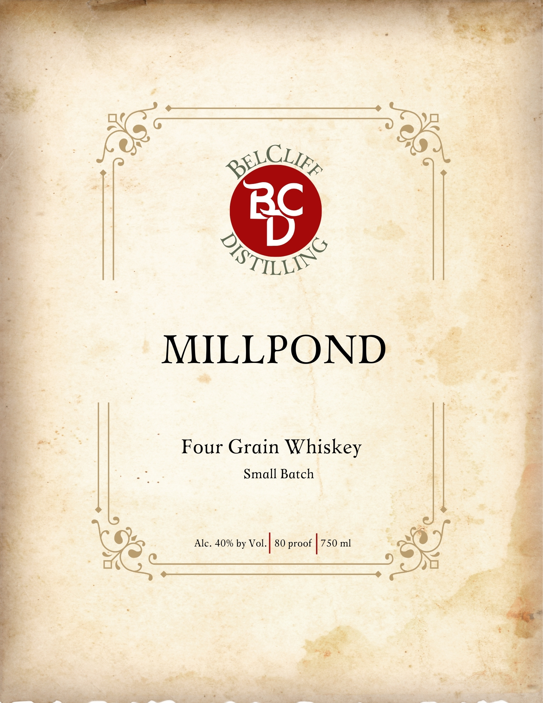

# TTB COLA Label Images - TTBID 26040001000644

**Brand Name:** MILLPOND FOUR GRAIN WHISKEY

**Issue Date:** 02/11/2026

**Origin Code:** 03

**Product Class/Type:** 140

**Source:** [TTB Public COLA Registry](https://ttbonline.gov/colasonline/viewColaDetails.do?action=publicFormDisplay&ttbid=26040001000644)

## Label Images

### Back Label

### Front Label

## Extracted Label Text

*Text extracted via OCR - may contain errors*

### Back Label

pits

sate

me

— oS

=

Named for the millponds that

fueled Belfast’s early mills, our

four-grain whiskey pays tribute

to the farms, fields, and hard

work that built our community

i

A true distiller’s spirit. We founded

BelCliff Distilling with a bold

$%

&

mission — to craft exceptional

spirits using techniques typically

reserved for the finest, most

exclusive bottles, and make them

accessible for everyone

*g

oe

Produced and bottled by

BelCliff Distilling, LLC

Belfast, NY

GOVERNMENT WARNING: (1) According to the

Surgeon General, women should not drink

alcoholic beverages during pregnancy because of

the risk of birth defects. (2) Consumption of

&

alcoholic beverages impairs your ability to drive a

'y car or operate machinery, and may cause health \

ie SS tee ae

problems.

es

ae

4

FP eS

opt

eT

Leg

dé

agate

ogee Sire

t=

### Front Label

g Cs
STS

MILLPOND

Four Grain Whiskey
Small Batch

Alc. 40% by Vol. 750 ml

80 proof
