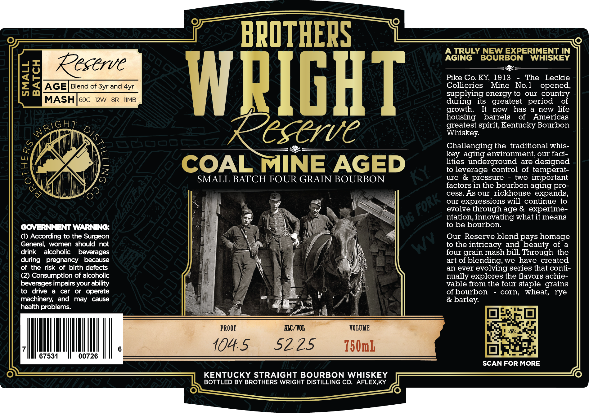

# TTB COLA Label Images - TTBID 26040001000686

**Brand Name:** BROTHERS WRIGHT RESERVE

**Issue Date:** 02/11/2026

**Origin Code:** 22

**Product Class/Type:** 101

**Source:** [TTB Public COLA Registry](https://ttbonline.gov/colasonline/viewColaDetails.do?action=publicFormDisplay&ttbid=26040001000686)

## Label Images

### Label 1

## Extracted Label Text

*Text extracted via OCR - may contain errors*

### Label 1

BROTH

NG beeen TRULY N

EXPERIMENT IN

AGING

B

BON WHISKEY

—————

Kestrve

Pike Co. KY, 1913 - The Leckie

Collieries Mine No.1

opened,

supplying energy to our country

during its greatest period of

growth.

It now has a new life

WHIGRT

housing barrels of Americas

2\GHT

greatest spirit, Kentucky Bourbon

Whiskey.

SN

SCHVE

Challenging the traditional whis-

key aging environment, our faci-

lities underground are designed

OAL MINE AGED

to leverage control of temperat-

|

SMALL BATCH FOUR GRAIN BOURBON

ure & pressure - two important

Hi

factors in the bourbon aging pro-

Xt

cess. As our rickhouse expands

*

our expressions will continue to

evolve through age & experime-

vi

LS

_—

ntation, innovating what it means

to be bourbon.

GOVERNMENT WARNING:

U

() According to the Surgeon

h)

fe

Our Reserve blend pays homage

General, women should not

2y

to the intricacy and beauty of a

drink alcoholic beverages

a

7)

four grain mash bill. Through the

during pregnancy because

of the risk of birth defects

art of blending, we have created

‘

an ever evolving series that conti-

(2) Consumption of alcoholic

J

\

nually explores the flavors achie-

beverages impairs your ability

vable from the four staple grains

to drive a car or operate

he

tat

of bourbon - corn, wheat.

rye

machinery, and may cause

a

av

Al

& barley.

health problems.

site

.

=n Cae

Re

oO

%

a

PROOF

ALC/VOL

VOLUME

hI

1045 | S225 | 150m

Ly

67531

00726

SCAN FOR MORE

KENTUCKY STRAIGHT BOURBON

BOTTLED BY BROTHERS WRIGHT DISTILLING CO. AFLEX,KY

——=————
