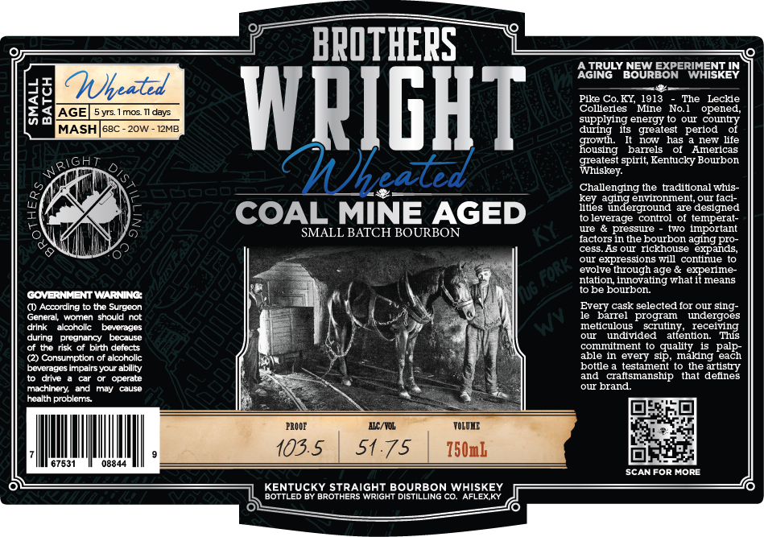

# TTB COLA Label Images - TTBID 26040001000687

**Brand Name:** BROTHERS WRIGHT WHEATED

**Issue Date:** 02/11/2026

**Origin Code:** 22

**Product Class/Type:** 101

**Source:** [TTB Public COLA Registry](https://ttbonline.gov/colasonline/viewColaDetails.do?action=publicFormDisplay&ttbid=26040001000687)

## Label Images

### Label 1

## Extracted Label Text

*Text extracted via OCR - may contain errors*

### Label 1

ee
BROTHERS | Y——_—_

drink alcoholic beverages
during pregnancy. because
Cf the risk of birth defects
@ Consumption of alcoholic
beverages impairs your ability
to drive a car or operate
‘machinery, and may cause
health problems.

COAL MINE AGED

SMALL BATCH BOURBON

67531

[rere

AC/YOL,
1.

75 | 150mL

(SITIES TIO Wet STRAIGHT BOURBON Massy [ ————__*
BOTTLED BY BROTHERS WRIGHT DISTILLING CO. AFLEXKY

A TRULY NEW EXPERIMENT IN
AGING BOURBON WHISKEY
—_—¢—

Pike Co.KY, 1913 - The Leckie
Collieries "Mine No.1 opened,
supplying energy to our country
during its greatest period of

jowth. It now has a new life
jousing barrels of Americas
greatest spirit, Kentucky Bourbon
‘Whiskey.

Challenging the traditional whis-
key aging environment, our faci-
lities underground are designed
toleverage control of temperat-
ure & pressure - two important
factors in the bourbon aging pro-
cess. As our rickhouse expands,
our expressions will continue to

evolve through age & experime-
niation, innovating what it means

tobe bourbon.

Every cask selected for our sing-
le barrel program undergoes
meticulous scrutiny, receiving
our undivided attention. This
commitment to quality is palp-
able in every sip, making each
bottle a testament to the artistry
and craftsmanship that defines

‘SCAN FOR MORE
