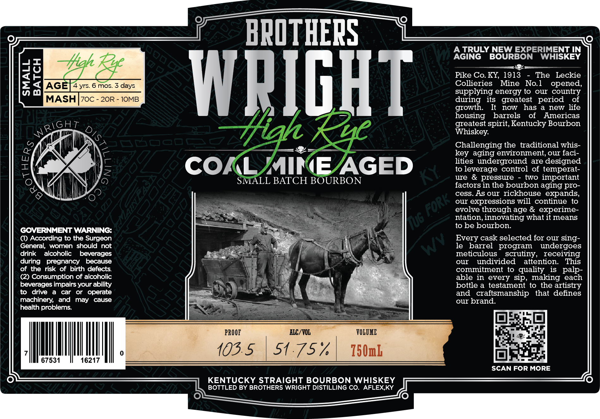

# TTB COLA Label Images - TTBID 26040001000689

**Brand Name:** BROTHERS WRIGHT HIGH RYE

**Issue Date:** 02/13/2026

**Origin Code:** 22

**Product Class/Type:** 101

**Source:** [TTB Public COLA Registry](https://ttbonline.gov/colasonline/viewColaDetails.do?action=publicFormDisplay&ttbid=26040001000689)

## Label Images

### Label 1

## Extracted Label Text

*Text extracted via OCR - may contain errors*

### Label 1

ee

——-

BROTHERS

A TRULY NEW EXPERIMENT IN

AGING BOURBON WHISKEY

ot

—= 3

10

<e

Pike Co. KY, 1913 - The Leckie

>=. § AG

4 yrs. 6 mos. 3 days

Collieries Mine No.1

opened,

supplying energy to our country

MASH ]|70c - 20R - 10oMB

during its greatest period of

growth.

It now has a new life

WRIGHT

housing barrels of Americas

aiGhT

greatest spirit, Kentucky Bourbon

0,

NS

Whiskey.

Challenging the traditional whis-

key aging environment, our faci-

NN

lities underground are designed

COAL MINE AGED

to leverage control of temperat-

i

N

ure & pressure - two important

{

SMALL BATCH BOURBON

factors in the bourbon aging pro-

U

\

li

cess. As our rickhouse expands,

—s

our expressions will continue to

evolve through age & experime-

ntation, innovating what it means

to be bourbon.

GOVERNMENT WARNING:

() According to the Surgeon

Every cask selected for our sing-

General, women should not

eo

le barrel program undergoes

drink alcoholic beverages

Mia)

meticulous scrutiny, receiving

during pregnancy because

ȴ

our undivided attention. This

of the risk of birth defects.

|

ses

heated

(2) Consumption of alcoholic

y

commitment to quality is palp-

hes

able in every sip, making each

beverages impairs your ability

the

Salt

bottle a testament to the artistry

to drive a car or operate

aN

and craftsmanship that defines

machinery, and may cause

te

our brand.

health problems.

\

aT

PROOF

ALC/VOL

VOLUME

ay

oF

1d

i

SU

|

67531

16217

|.

(QB) 510757,

=

SCAN FOR MORE

KENTUCKY STRAIGHT BOURBON WHISKEY

BOTTLED BY BROTHERS WRIGHT DISTILLING CO. AFLEX,KY
