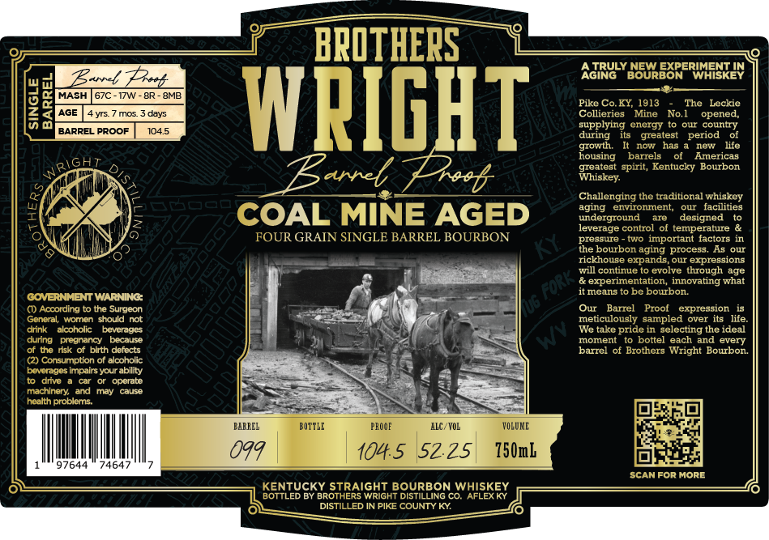

# TTB COLA Label Images - TTBID 26040001000691

**Brand Name:** BROTHERS WRIGHT BARREL PROOF

**Issue Date:** 02/11/2026

**Origin Code:** 22

**Product Class/Type:** 101

**Source:** [TTB Public COLA Registry](https://ttbonline.gov/colasonline/viewColaDetails.do?action=publicFormDisplay&ttbid=26040001000691)

## Label Images

### Label 1

## Extracted Label Text

*Text extracted via OCR - may contain errors*

### Label 1

ee —
mere! MRUTHERS \ eee

GLE
BARREL

SING

WRIGHT

“OAL MINE AGED

INGLE BARREL BOURBON

UR GRAIN

2NMENT WARNING:

cling to the Surgeon

women should not
alcoholic beverages
pregnancy because
risk of birth defects
sumption of alcoholic
es impairs your ability
@ a car oF operate
ny, and may cause
problems.

97644» 74647

nev. = VOLUME.
1045 52.25 80mb

RAIGHT BOURBON WHISKEY
RS WRIGI

BARREL PROOF

KENTUCKY S°
JOTTLED BY BRO

A TRULY NEW EXPERIMENT IN
AGING BOURBON WHISKEY

—
Pike Co.KY, 1913 - The Leckie
Collieries ‘Mine No.1 opened,
supplying energy to our country
during its greatest period of
growth. It now has a new life
housing barrels of Americas
greatest spirit, Kentucky Bourbon
‘Whiskey.

Challenging the traditional whiskey
aging environment, our facilities
underground are” designed to
leverage control of temperature &
pressure - two important factors in

the bourbon aging process. As our
rickhouse expands, our expressions
‘will continue to evolve through age
& experimentation, innovating what
itmeans to be bourbon,

Our Barrel Proof expression is
meticulously sampled over its life.
‘We take pride in selecting the ideal

ttel each and every
thers Wright Bourbon.

SCAN FOR MORE
