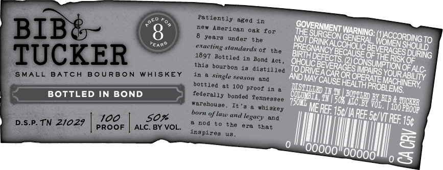

# TTB COLA Label Images - TTBID 26040001000703

**Brand Name:** BIB & TUCKER

**Issue Date:** 02/11/2026

**Origin Code:** 43

**Product Class/Type:** 111

**Source:** [TTB Public COLA Registry](https://ttbonline.gov/colasonline/viewColaDetails.do?action=publicFormDisplay&ttbid=26040001000703)

## Label Images

### Front Label

### Label 2

## Extracted Label Text

*Text extracted via OCR - may contain errors*

### Front Label

No’

THE SURGE

WARNING:

He)

Bi

EORINKALCORON

rote

hese

3 ‘DURING

OHOLIC,

IRTH Derec rs CAUSE OF THe

Ris

ISK.

OF ALC.

AND May,

TODRIVE,

‘ACAR OR

HEAL

S IMPAIRS,

OPERAy

FSYOUR

INE}

BOTTLED IN BOND

COnmMB TE

THES MAC

Ss

NEY

DOM

iyy 5th

AC BY Vor,

2U3IB 4 you

j

TRE 5g”

|

o =

=

0

l

0

I)

|

\

|

|

I)

SCS

I

### Label 2

oem

PROUDLY MADE IN

DISTILLED IN

Tennessee

Spring 2018

— EAR? a
