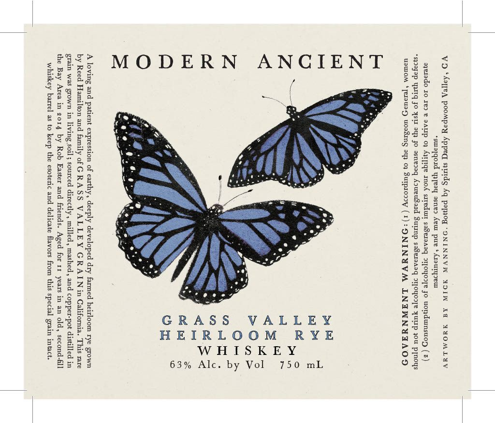

# TTB COLA Label Images - TTBID 26040001000738

**Brand Name:** MODERN ANCIENT

**Fanciful Name:** GRASS VALLEY HEIRLOOM RYE

**Issue Date:** 02/11/2026

**Origin Code:** 01

**Product Class/Type:** 140

**Source:** [TTB Public COLA Registry](https://ttbonline.gov/colasonline/viewColaDetails.do?action=publicFormDisplay&ttbid=26040001000738)

## Label Images

### Front Label

### Label 2

## Extracted Label Text

*Text extracted via OCR - may contain errors*

*1 image(s) excluded: text did not meet readability threshold*

### Front Label

Vo ‘Aoyjea poompay Appea simtdg hq pomnog “ONINNVW XOIN Ad YVOMLYY
suiajqoad wpeay asne> Aeur pure Azouryseur
ayerodo 10 xe9 v aarp 03 Arrpiqe amok sxredurr sa8ex9A0q soyooye jo wondumsuoz (5)
“soayap pM Jo Yeu ayy Jo aeneoaq AoueuBard Sump saBes9A2q soyore UEP you Pnoys
usWOM ‘Terug wossmng oy 01 Sutprony (1): ONINUVM LNEIWNUTAOD

750 mL

63% Alc. by Vol

MODERN ANCIENT

A loving and patient expression of earthy, deeply developed dry farmed heirloom rye grown
by Reed Hamilton and family of GRASS VALLEY GRAIN in California. This rare
grain was grown in living soil 5 sourced directly, milled, mashed , and copper-pot distilled in
the Bay Area in 2014 by Rob Easter and friends. Aged for 11 years in an old, second-fll
whiskey barrel as to keep the esoteric and delicate flavors from this special grain intact.
