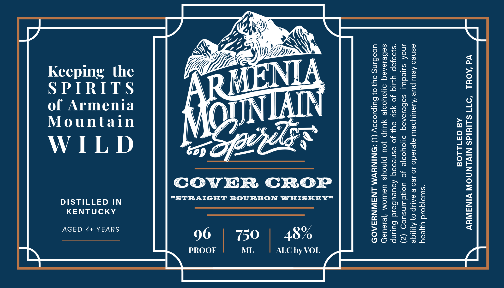

# TTB COLA Label Images - TTBID 26040001000824

**Brand Name:** COVER CROP

**Issue Date:** 02/11/2026

**Origin Code:** 39

**Product Class/Type:** 101

**Source:** [TTB Public COLA Registry](https://ttbonline.gov/colasonline/viewColaDetails.do?action=publicFormDisplay&ttbid=26040001000824)

## Label Images

### Label 1

## Extracted Label Text

*Text extracted via OCR - may contain errors*

### Label 1

Fo.

4

Oy

y,

Zz

ty

yy

PY,

Ait.

oo 2

Vie

Es

N

>To

Keeping the

po

My

oo

>

x

AF

Ls

TA

ee}

SPIRITS

lone

loyrras

of Armenia

AIN

T=

Mountain

Noun

Ox

=-T

(FS

WILD

= 0

COVER CROP

LG

DISTILLED IN

"STRAIGHT BOURBON WHISKEY’

DE

KENTUCKY

xe}

Co

De

>

AGED 4+ YEARS

(Ss Oo; P=]

96

50

48%

(0) 5s Qos

PROOF

ML

ALC by VOL
