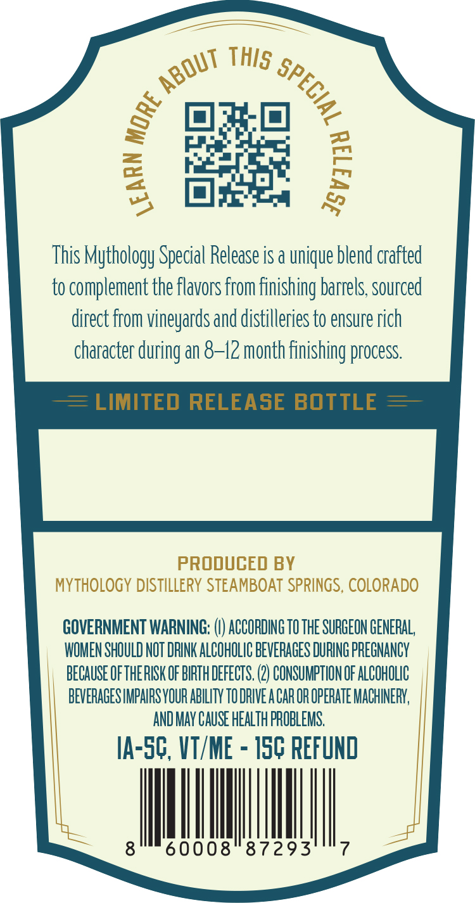
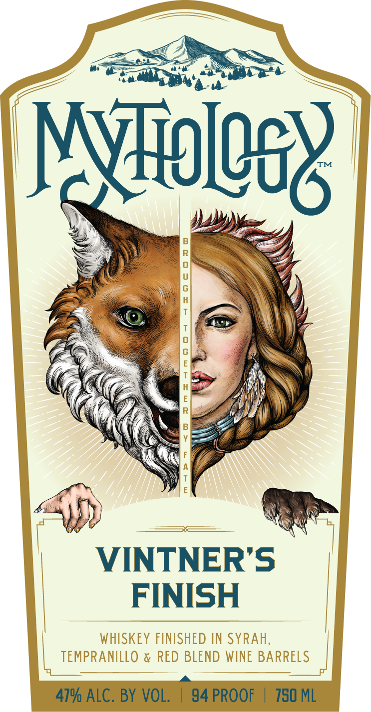

# TTB COLA Label Images - TTBID 26040001000854

**Brand Name:** MYTHOLOGY

**Fanciful Name:** VINTNER'S FINISH

**Issue Date:** 02/11/2026

**Origin Code:** 13

**Product Class/Type:** 140

**Source:** [TTB Public COLA Registry](https://ttbonline.gov/colasonline/viewColaDetails.do?action=publicFormDisplay&ttbid=26040001000854)

## Label Images

### Back Label

### Front Label

## Extracted Label Text

*Text extracted via OCR - may contain errors*

*1 image(s) excluded: text did not meet readability threshold*

### Back Label

Sagem %

ns

=

ee

This Mythology Special Release is a unique blend crafted

to complement the flavors from finishing barrels, sourced

direct from vineyards and distilleries to ensure rich

character during an 8-12 month finishing process

PRODUCED BY

MYTHOLOGY DISTILLERY STEAMBOAT SPRINGS, COLORADO

GOVERNMENT WARNING: (|) ACCORDING T0 THE SURGECN GENERAL

WOMEN SHOULD NOT DRINK ALCOHOLIC BEVERAGES DURING PREGNANCY

BECAUSE OF THERISK OF BIRTH DEFECTS. (2) CONSUMPTION OF ALCOHOLIC

BEVERAGES IMPAIRS YOUR ABILITY TO DRIVE A CAR OR OPERATE MACHINERY,

AND MAY CAUSE HEALTH PROBLEMS

IA-SG, VT/ME - 156 REFUND

MI

|

ll
