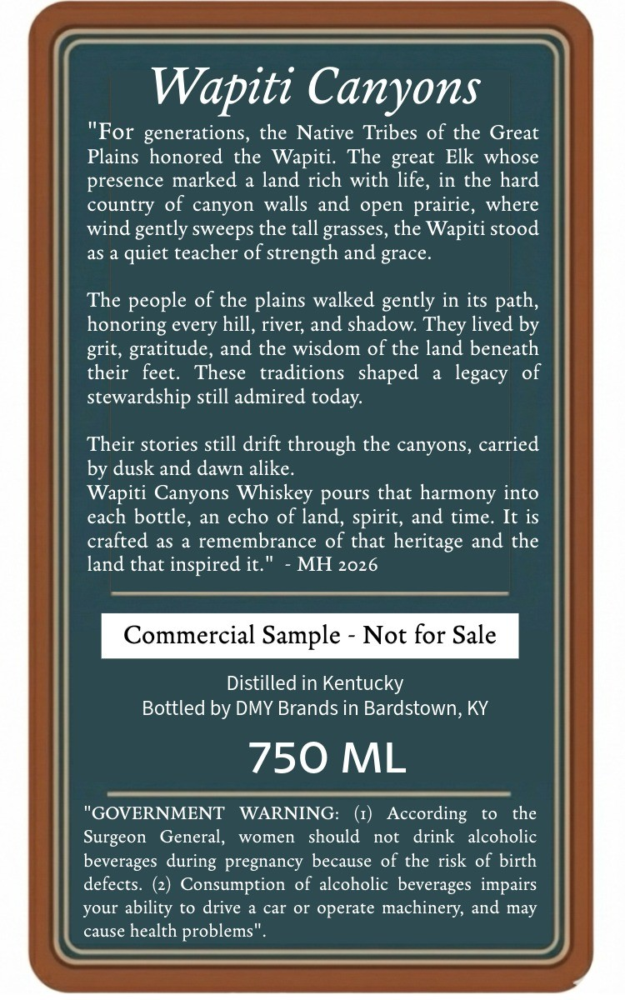
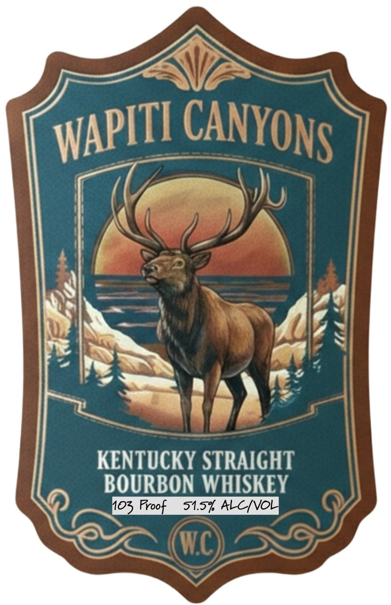

# TTB COLA Label Images - TTBID 26041001000070

**Brand Name:** WAPITI CANYONS

**Issue Date:** 02/12/2026

**Origin Code:** 22

**Product Class/Type:** 101

**Source:** [TTB Public COLA Registry](https://ttbonline.gov/colasonline/viewColaDetails.do?action=publicFormDisplay&ttbid=26041001000070)

## Label Images

### Back Label

### Label 1

## Extracted Label Text

*Text extracted via OCR - may contain errors*

### Back Label

Wapiti Canyons
"For generations, the Native Tribes of the Great
Plains honored the Wapiti. The great Elk whose
presence marked a land rich with life, in the hard
country of canyon walls and open prairie, where
wind gently sweeps the tall grasses, the Wapiti stood
as a quiet teacher of strength and grace.

The people of the plains walked gently in its path,
honoring every hill, river, and shadow. They lived by
grit, gratitude, and the wisdom of the land beneath
their feet. These traditions shaped a legacy of
stewardship still admired today.

Their stories still drift through the canyons, carried
by dusk and dawn alike.

Wapiti Canyons Whiskey pours that harmony into
each bottle, an echo of land, spirit, and time. It is
crafted as a remembrance of that heritage and the
land that inspired it." - MH 2026

Commercial Sample - Not for Sale

Distilled in Kentucky
Bottled by DMY Brands in Bardstown, KY

750 ML

"GOVERNMENT WARNING: (1) According to the
Surgeon General, women should not drink alcoholic
beverages during pregnancy because of the risk of birth
defects. (2) Consumption of alcoholic beverages impairs
your ability to drive a car or operate machinery, and may

cause health problems".
K— E ——

### Label 1

yt

s
AR
aa ~

Vee SEA Ae
> ny ES

KENTUCKY STRAIGHT
BOURBON WHISKEY
PI oS Foot 315% ALCL
