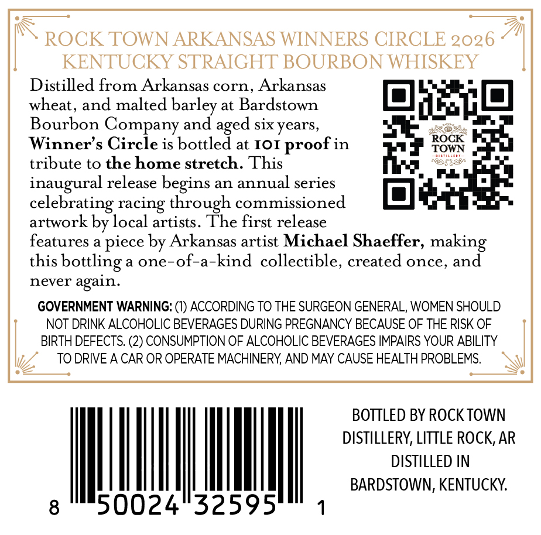
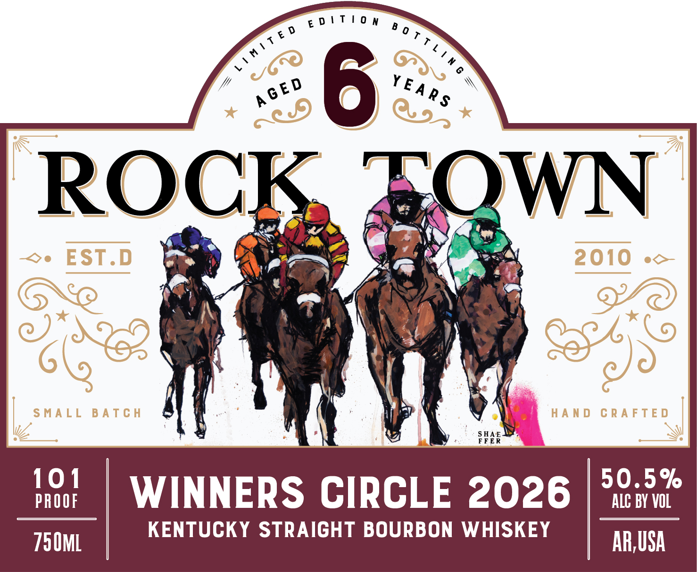

# TTB COLA Label Images - TTBID 26041001000137

**Brand Name:** ROCK TOWN

**Issue Date:** 02/12/2026

**Origin Code:** 12

**Product Class/Type:** 101

**Source:** [TTB Public COLA Registry](https://ttbonline.gov/colasonline/viewColaDetails.do?action=publicFormDisplay&ttbid=26041001000137)

## Label Images

### Back Label

### Front Label

## Extracted Label Text

*Text extracted via OCR - may contain errors*

*1 image(s) excluded: text did not meet readability threshold*

### Back Label

ROCK TOWN ARKANSAS WINNERS CIRCLE

2020

KENTUCKY STRAIGHT BOURBON WHISKEY

Distilled from Arkansas corn, Arkansas

wheat, and malted barley at Bardstown

f=

Bourbon Company and aged six years,

eg

Winner’s Circle is bottled at 101 proof in

tribute to the home stretch. This

ae

o Poe

inaugural release begins an annual series

celebrating racing through commissioned

artwork by local artists. The first release

features a piece by Arkansas artist Michael Shaeffer, making

this bottling a one-of-a-kind collectible, created once, and

never again.

GOVERNMENT WARNING: (1) ACCORDING TO THE SURGEON GENERAL, WOMEN SHOULD

NOT DRINK ALCOHOLIC BEVERAGES DURING PREGNANCY BECAUSE OF THE RISK OF

I

BIRTH DEFECTS. (2) CONSUMPTION OF ALCOHOLIC BEVERAGES IMPAIRS YOUR ABILITY

TO DRIVE A CAR OR OPERATE MACHINERY, AND MAY CAUSE HEALTH PROBLEMS.

|

—o

BOTTLED BY ROCK TOWN

DISTILLERY, LITTLE ROCK, AR

DISTILLED IN

|

WA

BARDSTOWN, KENTUCKY.

8

50024°32595

1
