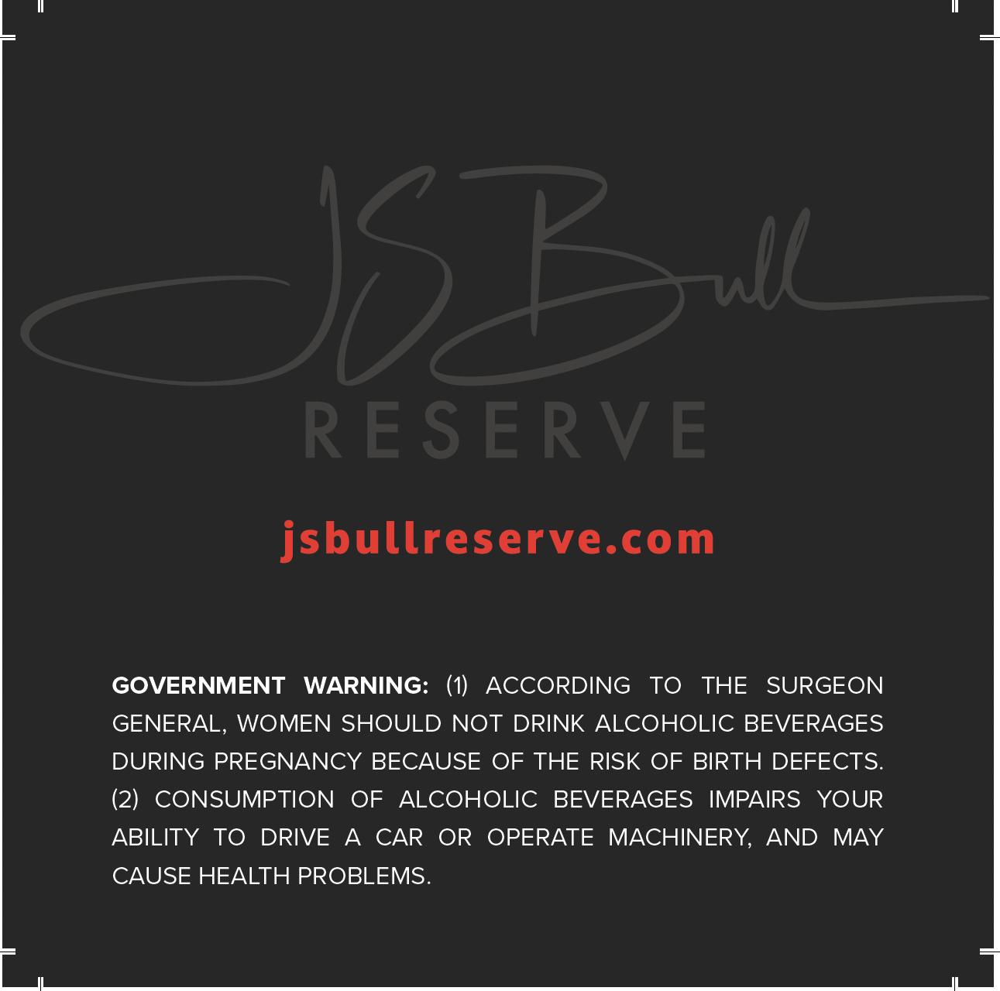
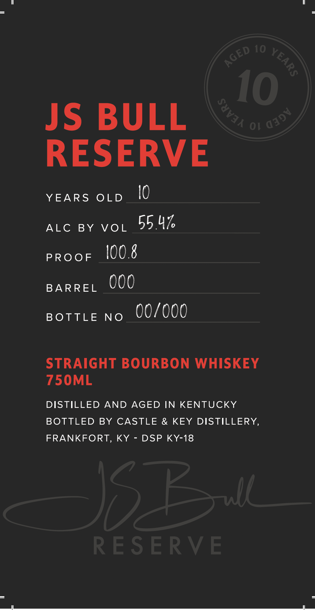

# TTB COLA Label Images - TTBID 26041001000171

**Brand Name:** JS BULL RESERVE

**Issue Date:** 02/11/2026

**Origin Code:** 22

**Product Class/Type:** 101

**Source:** [TTB Public COLA Registry](https://ttbonline.gov/colasonline/viewColaDetails.do?action=publicFormDisplay&ttbid=26041001000171)

## Label Images

### Back Label

### Front Label

## Extracted Label Text

*Text extracted via OCR - may contain errors*

### Back Label

ba

"|

jsbullreserve.com

GOVERNMENT WARNING: (1) ACCORDING TO THE SURGEON

GENERAL, WOMEN SHOULD NOT DRINK ALCOHOLIC BEVERAGES

DURING PREGNANCY BECAUSE OF THE RISK OF BIRTH DEFECTS.

(2) CONSUMPTION OF ALCOHOLIC BEVERAGES IMPAIRS YOUR

ABILITY TO DRIVE A CAR OR OPERATE MACHINERY, AND MAY

CAUSE HEALTH PROBLEMS.

### Front Label

JS BULL

RESERVE

YEARS OLD

l0

ALC BY VOL 55 4Z

PROOF

100.8

BARREL 000

BOTTLE NO 00/000

STRAIGHT BOURBON WHISKEY

750ML

DISTILLED AND AGED IN KENTUCKY

BOTTLED BY CASTLE & KEY DISTILLERY,

FRANKFORT, KY - DSP KY-18

BSN | (ames ne kr a eee ea
