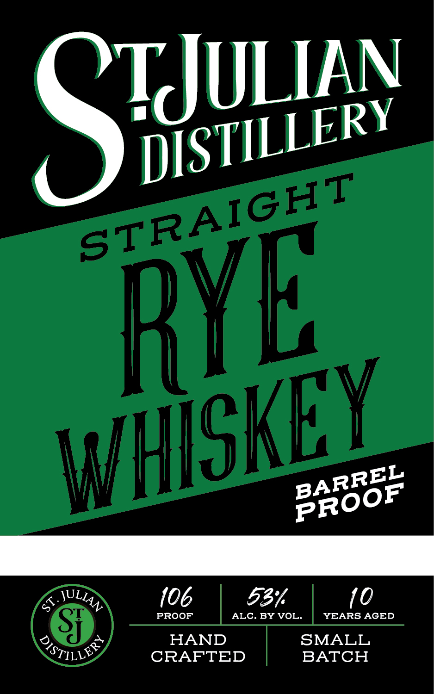
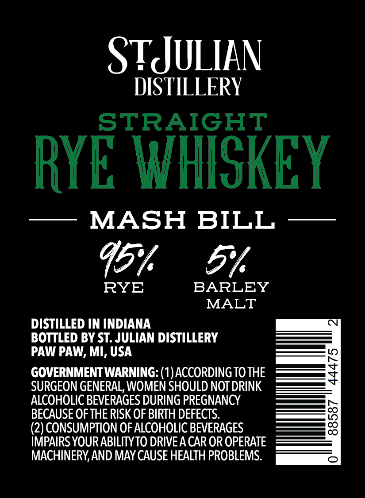

# TTB COLA Label Images - TTBID 26041001000287

**Brand Name:** ST. JULIAN DISTILLERY

**Issue Date:** 02/11/2026

**Origin Code:** 06

**Product Class/Type:** 102

**Source:** [TTB Public COLA Registry](https://ttbonline.gov/colasonline/viewColaDetails.do?action=publicFormDisplay&ttbid=26041001000287)

## Label Images

### Label 1

### Label 2

## Extracted Label Text

*Text extracted via OCR - may contain errors*

### Label 1

AN

TJ

ULI

TILL

ERY

DIS

REL

pAR

RO

OF

a

Naty

PROOF

106

ee, vent ones

Sry L “©

HAND

SMALL

CRAFTED

BATCH

### Label 2

ST JULIAN

DISTILLERY

STRAIGHT

RYE WHISKEY

— MASH BILL —

Uh Gu

BARLEY

RYE

MALT

DISTILLED IN INDIANA

BOTTLED BY ST. JULIAN DISTILLERY

PAW PAW, MI, USA

GOVERNMENT WARNING: (1) ACCORDING TO THE

SURGEON GENERAL, WOMEN SHOULD NOT DRINK

ALCOHOLIC BEVERAGES DURING PREGNANCY

BECAUSE OF THE RISK OF BIRTH DEFECTS.

(2) CONSUMPTION OF ALCOHOLIC BEVERAGES

IMPAIRS YOUR ABILITY TO DRIVE A CAR OR OPERATE

MACHINERY, AND MAY CAUSE HEALTH PROBLEMS.
