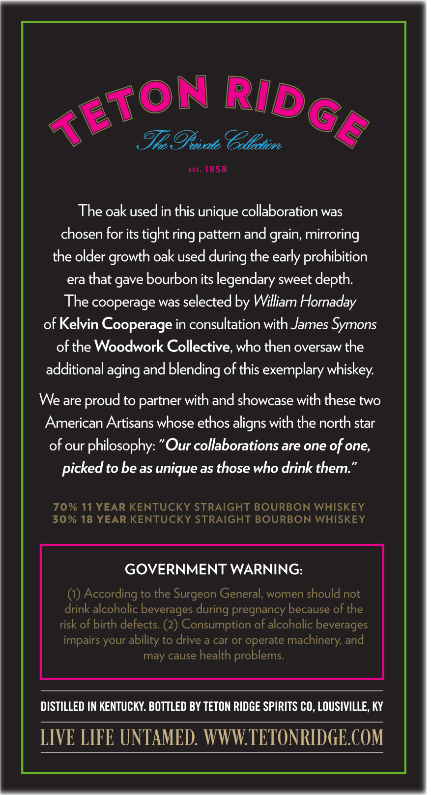
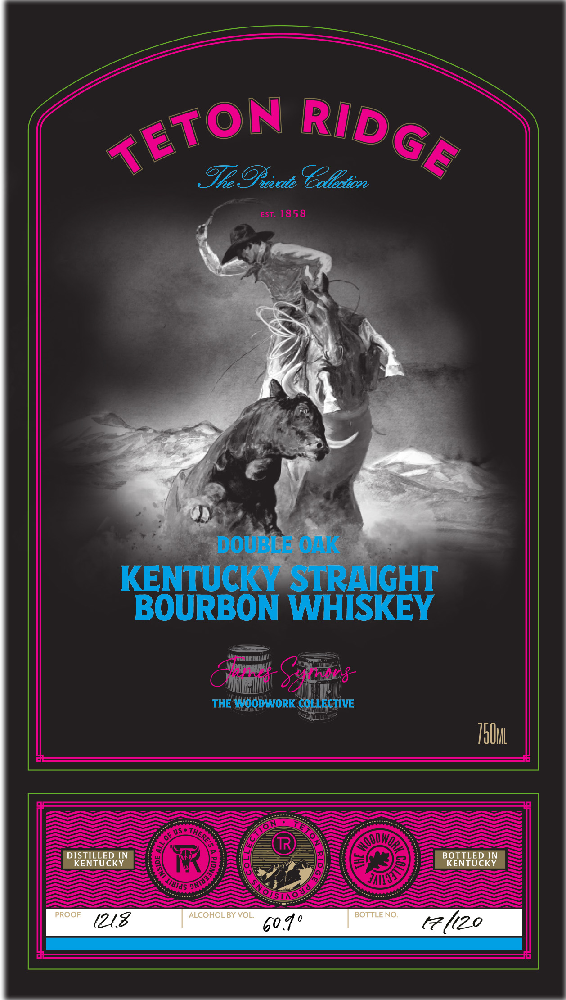

# TTB COLA Label Images - TTBID 26041001000525

**Brand Name:** TETON RIDGE

**Issue Date:** 03/02/2026

**Origin Code:** 22

**Product Class/Type:** 101

**Source:** [TTB Public COLA Registry](https://ttbonline.gov/colasonline/viewColaDetails.do?action=publicFormDisplay&ttbid=26041001000525)

## Label Images

### Back Label

### Label 1

## Extracted Label Text

*Text extracted via OCR - may contain errors*

*1 image(s) excluded: text did not meet readability threshold*

**Detected Age:** 11 Years

### Back Label

ON ‘@) NI R I | VN
FH *< CWIIN ING |») YN
AY Was
» She Rrisate Colatin y
est. 1858
The oak used in this unique collaboration was
chosen for its tight ring pattern and grain, mirroring
the older growth oak used during the early prohibition
era that gave bourbon its legendary sweet depth.
The cooperage was selected by William Hornaday
of Kelvin Cooperage in consultation with James Symons
of the Woodwork Collective, who then oversaw the
additional aging and blending of this exemplary whiskey.
We are proud to partner with and showcase with these two
American Artisans whose ethos aligns with the north star
of our philosophy: “Our collaborations are one of one,
picked to be as unique as those who drink them.”
70% 11 YEAR KENTUCKY STRAIGHT BOURBON WHISKEY
30% 18 YEAR KENTUCKY STRAIGHT BOURBON WHISKEY
GOVERNMENT WARNING:
(1) According to the Surgeon General, women should not
drink alcoholic be verages during pregnancy because of the
risk of birth defects. (2) Consumption of alcoholic beverages
impairs your ability to drive a car or operate machinery, and
DISTILLED IN KENTUCKY. BOTTLED BY TETON RIDGE SPIRITS CO, LOUSIVILLE, KY
LIVE LIFE UNTAMED. WWW.TETONRIDGE.COM
