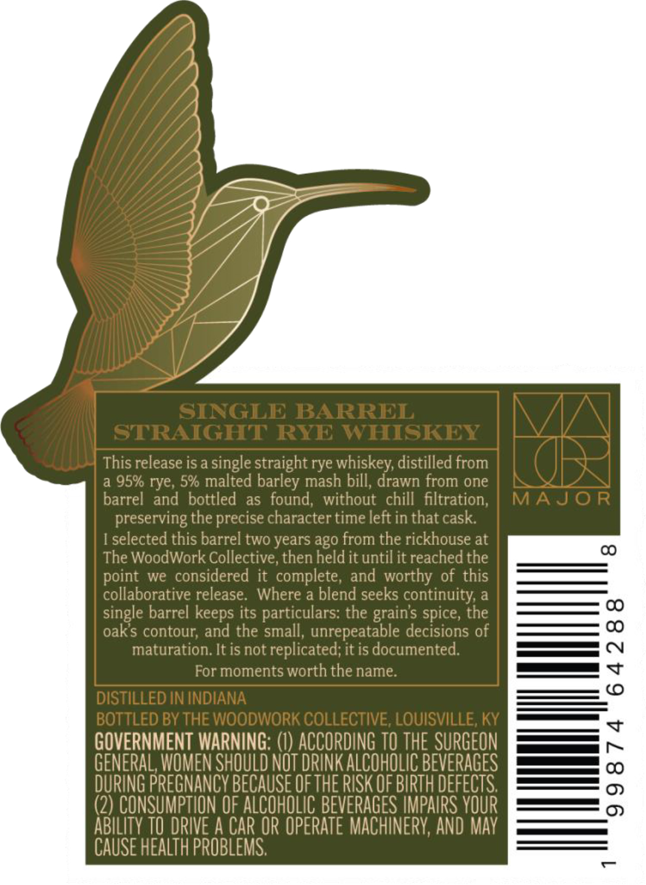
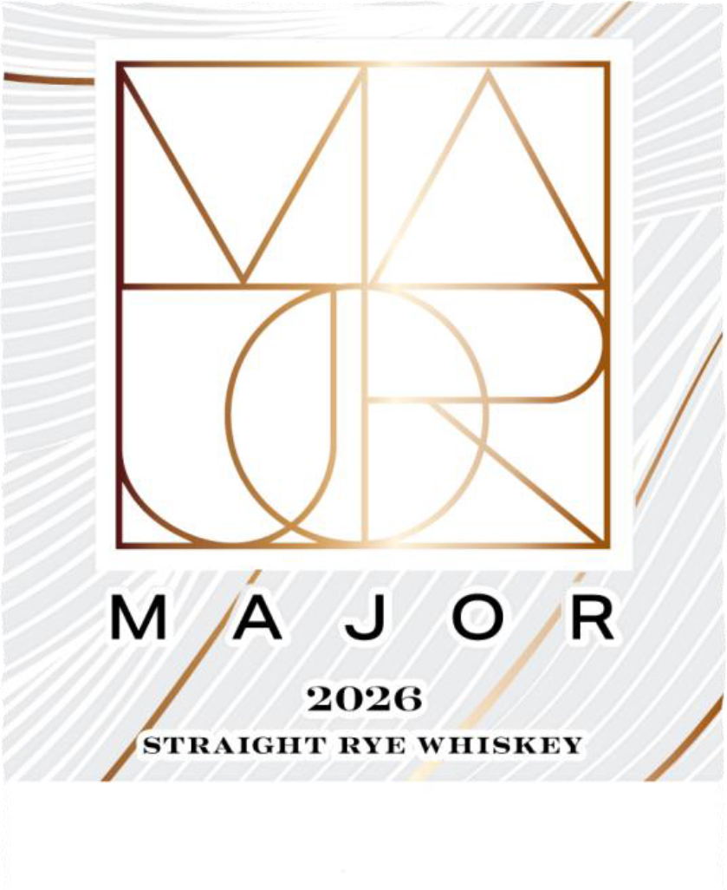
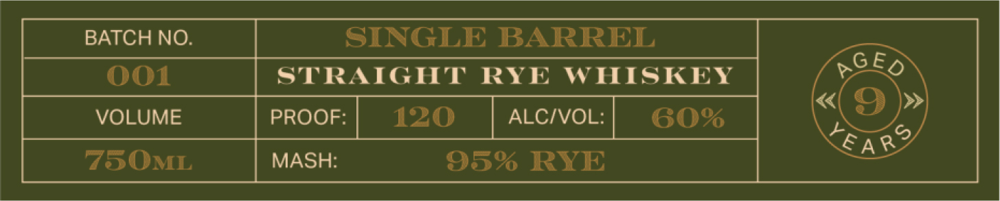

# TTB COLA Label Images - TTBID 26041001000531

**Brand Name:** MAJOR

**Issue Date:** 02/11/2026

**Origin Code:** 22

**Product Class/Type:** 102

**Source:** [TTB Public COLA Registry](https://ttbonline.gov/colasonline/viewColaDetails.do?action=publicFormDisplay&ttbid=26041001000531)

## Label Images

### Back Label

### Label 1

### Label 2

### Label 4

## Extracted Label Text

*Text extracted via OCR - may contain errors*

### Back Label

nung

“A

ae CN

es <

GOVERN

ees ~

GE

yA

AL, ¥

MENT W

\

mR

NING: (|

OUI

N

VANC

B

R

sk

ees OO

t REY

) [

Ci}

Oh

{}

II

C \ Ou R

10

MAN {ih

AN

A

CAUS

0

### Label 1

fod

eed

2026

V Le RYE WHISKEY

,

### Label 2

BATCH NO.

SINGLE

BARREL

oOo!1

TRAIGHT RYE WHISKEY

peko

«

»

VOLUME

PROOF 120 _ ALC/VOL | 60%

EA

750MI

MASH

5% RYE

### Label 4

H THI

NAME

N

|

SLNAWOW 8
