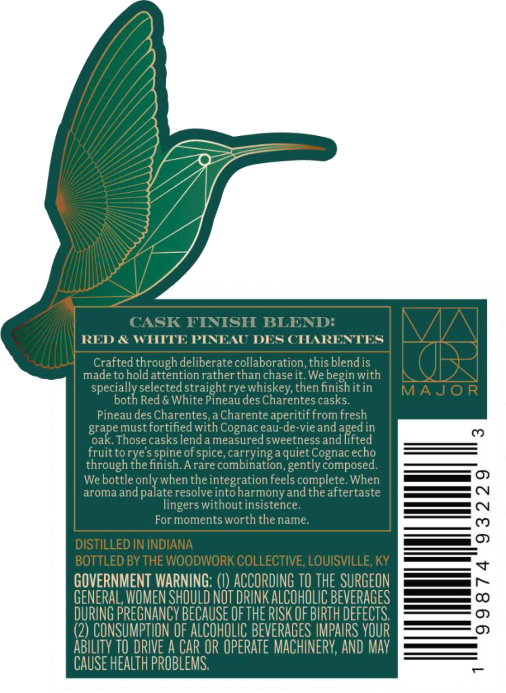
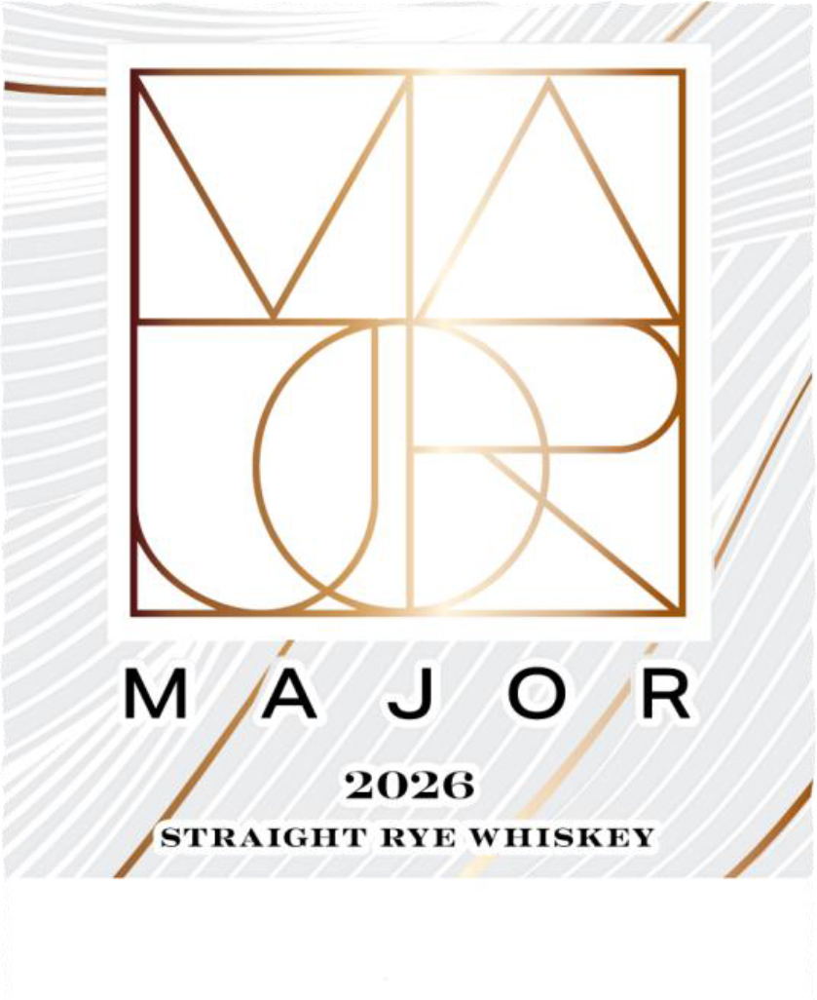
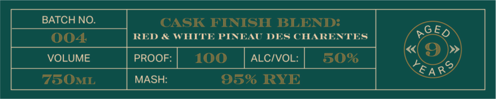

# TTB COLA Label Images - TTBID 26041001000536

**Brand Name:** MAJOR

**Issue Date:** 02/11/2026

**Origin Code:** 22

**Product Class/Type:** 102

**Source:** [TTB Public COLA Registry](https://ttbonline.gov/colasonline/viewColaDetails.do?action=publicFormDisplay&ttbid=26041001000536)

## Label Images

### Back Label

### Label 1

### Label 2

### Label 4

## Extracted Label Text

*Text extracted via OCR - may contain errors*

### Back Label

RED & WHITTI

PINEAL

DES CHARENTES

d throug

berat

n

irat

nc

el

itt

ie

a IT

ast

tn

lifted

rt

ICE

t(

h

hrought

il

co

IT

tl

ed

h

I

en

ee ©

ar

it

Ttert

+f

utin

Es ON

Fo

1

nt

rt

es ©

oP CH

GOVERNM Alf WARNING: (1) ACCORDING TO THE SU

ees ~

GENERAL, W

ME

N SHOULD

NOT DRINK A LCOHOLIC BEVERAGES

DURING BREGNANGY BECA USE OFTH

IE RISK OF BIRTH DEFECTS.

Ag

(2) CONSUMPTION 0

OF ALCOHOLIC BEVERAGE

ES IMPAIF cael

BILITY TO DRIVE A CAR OR OPERATE |

HINERY, AND M

DITA

CAUSE

ITH PROB

BLEW

MS.

### Label 1

fod

eed

2026

V Le RYE WHISKEY

,

### Label 2

CASK FINISH BLEND:

GEg

RED & WHITE PINEAU DES CHARENTES

«

»

PROOF:

100

ALC/VOL:

509

EA

MASH:

95% RYE

### Label 4

—

°)

OMENTS

H THE NAMI

AN SHL HL

\ SLNAW

|

4
