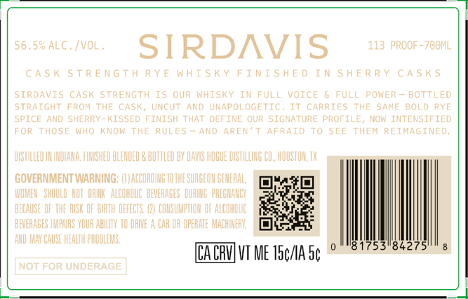
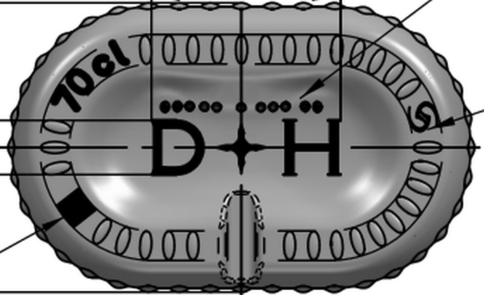

# TTB COLA Label Images - TTBID 26041001000578

**Brand Name:** SIRDAVIS

**Issue Date:** 02/11/2026

**Origin Code:** 44

**Product Class/Type:** 142

**Source:** [TTB Public COLA Registry](https://ttbonline.gov/colasonline/viewColaDetails.do?action=publicFormDisplay&ttbid=26041001000578)

## Label Images

### Label 1

### Label 2

### Label 3

## Extracted Label Text

*Text extracted via OCR - may contain errors*

### Label 1

SIRDAVIS

J

N

E

I

f

GOVERNMENT WARNING:

0

K

l

I

iH

i

0

ILITY

i

Bl

0

WU

CACAV] VI ME 15¢/IA Sp ° S1”?? Sherer"

— |

|

### Label 2

[|

TOO

~

_

5

a

.

My,

0 U

oe

i

ms

### Label 3

a

7 — >

CASK STRENGTH

SIRDAVIS

RYE WHISKY FINISHED

CASK STRENGTH

IN SHERRY CASKS

ws

—
