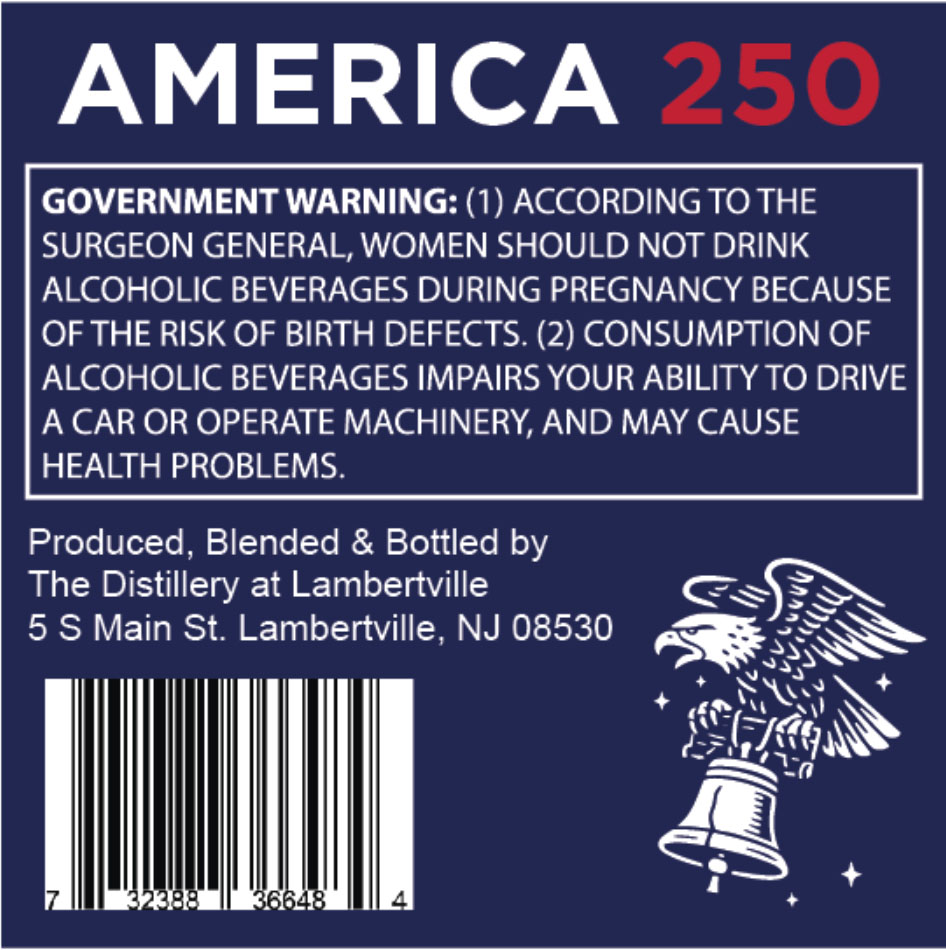
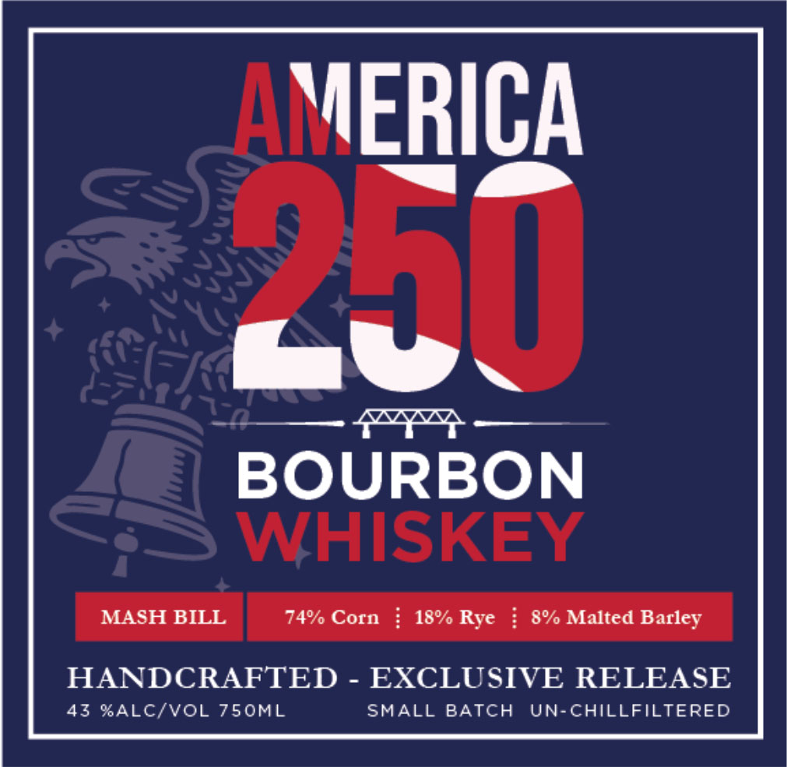

# TTB COLA Label Images - TTBID 26042001000071

**Brand Name:** AMERICA 250 BOURBON WHISKEY

**Issue Date:** 02/12/2026

**Origin Code:** 03

**Product Class/Type:** 141

**Source:** [TTB Public COLA Registry](https://ttbonline.gov/colasonline/viewColaDetails.do?action=publicFormDisplay&ttbid=26042001000071)

## Label Images

### Back Label

### Front Label

## Extracted Label Text

*Text extracted via OCR - may contain errors*

### Back Label

GOVERNMENT WARNING: (1) ACCORDING TO THE
SURGEON GENERAL, WOMEN SHOULD NOT DRINK
ALCOHOLIC BEVERAGES DURING PREGNANCY BECAUSE
OF THE RISK OF BIRTH DEFECTS. (2) CONSUMPTION OF
ALCOHOLIC BEVERAGES IMPAIRS YOUR ABILITY TO DRIVE
A CAR OR OPERATE MACHINERY, AND MAY CAUSE
HEALTH PROBLEMS.
Produced, Blended & Bottled by
The Distillery at Lambertville ESN
5 S Main St. Lambertville, NJ 08530 BES
+ Nya \ +
+ PPSNOSNY
RUNS
=a
MUL ) +

### Front Label

BOURBON
WHISKEY
| MASHTBILL 7% Coen | 184 Rye | WH Mated Bacey
HANDCRAFTED - EXCLUSIVE RELEASE
43 %ALC/VOL 750ML SMALL BATCH UN-CHILLFILTERED
