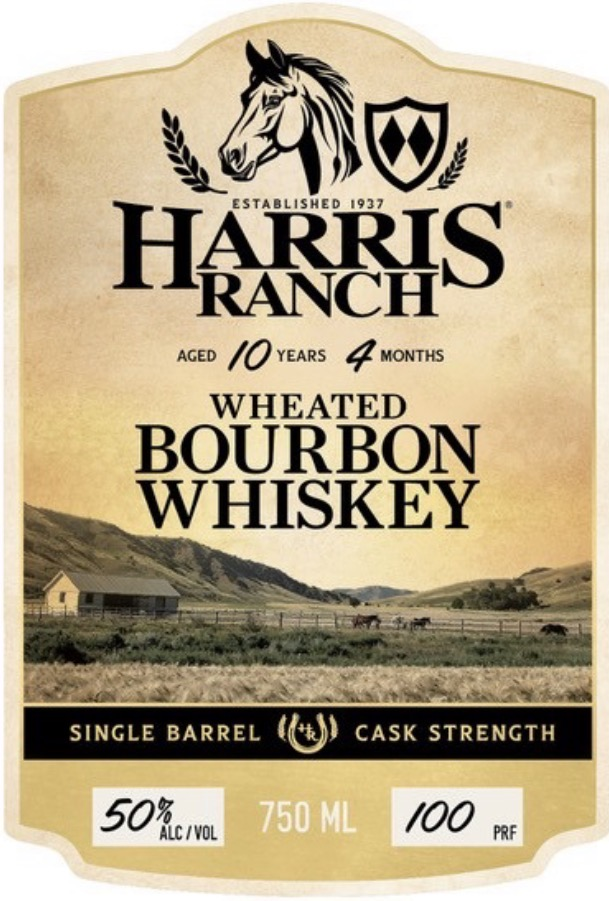
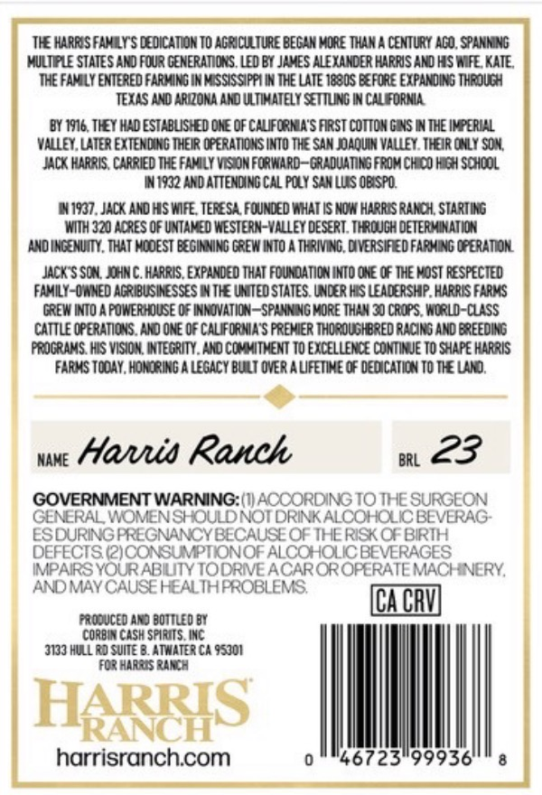

# TTB COLA Label Images - TTBID 26042001000080

**Brand Name:** HARRIS RANCH

**Issue Date:** 02/12/2026

**Origin Code:** 01

**Product Class/Type:** 141

**Source:** [TTB Public COLA Registry](https://ttbonline.gov/colasonline/viewColaDetails.do?action=publicFormDisplay&ttbid=26042001000080)

## Label Images

### Label 1

### Label 2

## Extracted Label Text

*Text extracted via OCR - may contain errors*

### Label 1

LNG

HARRIS

aceo (0) vears GF wontus

WHEATED

BOURBON

WHISKEY

=e

Pa? SS

Peet i ee |

ING

50%, 1VOL

100

### Label 2

=

THE HARRS FAMEY' DEDCATON TO AGRICULTURE BESIM MORE THAM CENTURY ASD ‘SPANNING

]

(MULTIPLE STATES AND FOUR GENERATIONS. LED BY JAMES ALEXANDER HARRIS AND HIS WIFE, KATE,

‘THE FAMILY ENTERED FARMING IN MISSISSIPPI IN THE LATE 1880S BEFORE EXPANDING THROUGH

TEXAS AND ARIZONA AND ULTIMATELY SETTLING IN CALIFORNIA.

BY 1916, THEY HAD ESTABLISHED ONE OF CALIFORNIA'S FIRST COTTON GINS IN THE IMPERIAL

VALLEY, LATER EXTENDING THEIR OPERATIONS INTO THE SAN JOAQUIN VALLEY. THEIR ONLY SOM,

JACK HARRIS, CARRIED THE FAMILY VISION FORWARD—GRADUATING FROM CHICO HIGH SCHOOL

IN 1932 AND ATTENDING CAL POLY SAN LUES OBISPO.

1N19G7, JACK AND HIS WIFE, TERESA. FOUNDED WHAT IS NOW HARRIS RANCH, STARTING

WITH 320 ACRES OF UNTAMED WESTERN-VALLEY DESERT. THROUGH DETERMINATION

‘AND INGENUITY. THAT MODEST BEGINNING GREW INTO A THRIVING, DIVERSIFIED FARING OPERATION.

JACK'S SON, JOHN C. HARRIS, EXPANDED THAT FOUNDATION INTO ONE OF THE MOST RESPECTED

FAMILY-OWNED AGRIBUSINESSES IN THE UNITED STATES. UNDER HIS LEADERSHIP, HARRIS FARMS

GREW INTO A POWERHOUSE OF INNOVATION—SPANNING MORE THAN 30 CROPS, WORLD-CLASS

CATTLE OPERATIONS. AND ONE OF CALIFORNIA'S PREMIER THOROUGHBRED RACING AND BREEDING

PROGRAMS. HIS VISION, INTEGRITY. AND COMMITMENT TO EXCELLENCE CONTINUE TO SHAPE HARRIS

FARMS TODAY, HONORING A LEGACY BUILT OVER A LIFETIME OF DEDICATION TO THE LAND.

une Hans Ranh

BRL 23

‘WARNING: (1) ACCORDING TO THE SURGEON

GENERAL, WOMEN SHOULD NOT DRINK ALCOHOLIC BEVERAG-

ES DURING PREGNANCY BECAUSE OF THE RISK OF BIRTH

DEFECTS (2) CONSUMPTION OF ALCOHOLIC BEVERAGES

IMPAIRS YOUR ABILITY TO DRIVE ACAR OR OPE ioc] MACHINERY,

AND MAY CAUSE HEALTH PROBLEMS.

CORBIN

SPIRITS. INC

‘3133 HULL RD SUITE B. ATWATER CA 95301

I

:

|

|

harrisranch.com

46723°99936
