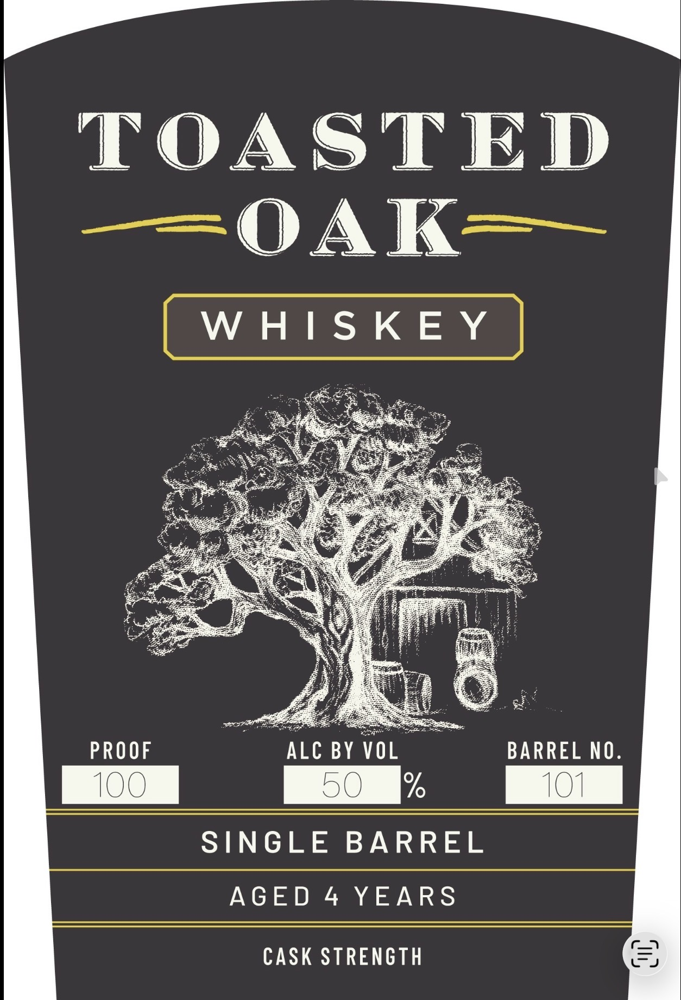
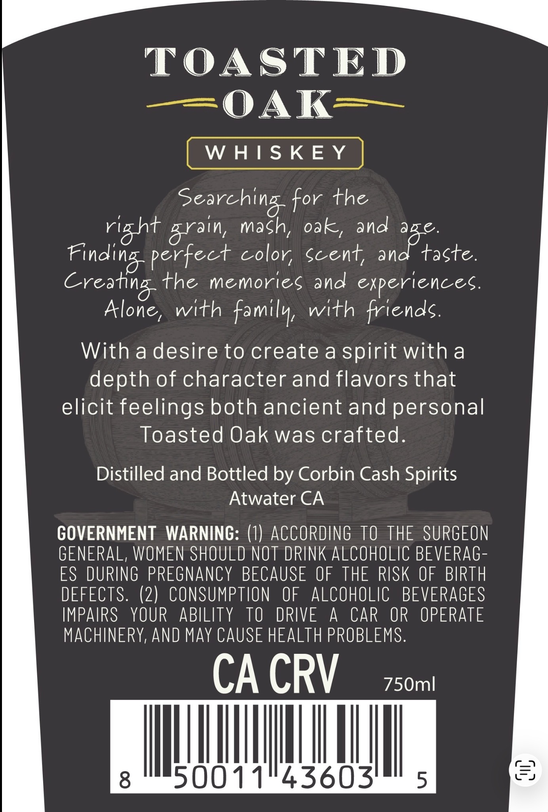

# TTB COLA Label Images - TTBID 26042001000088

**Brand Name:** TOASTED OAK

**Issue Date:** 03/05/2026

**Origin Code:** 01

**Product Class/Type:** 140

**Source:** [TTB Public COLA Registry](https://ttbonline.gov/colasonline/viewColaDetails.do?action=publicFormDisplay&ttbid=26042001000088)

## Label Images

### Label 1

### Label 2

## Extracted Label Text

*Text extracted via OCR - may contain errors*

**Detected Age:** 4 Years

### Label 1

TOASTED

WHISKEY

PROOF "ALC BY VOL BARREL NO.

| 50 101
SINGLE BARREL

AGED 4 YEARS

CASK STRENGTH

### Label 2

TOASTED
=OAK
W HIS KE Y
Searching for the
riaht
mach; ok,
and ae.
perfect color; Scent;
taste.
the memorieg and
experiences
Alone ,
with familv
with friends:
With a desire to create a spirit with a
depth of character and flavors that
elicit feelings both ancient and personal
Toasted Oak was crafted.
Distilled and Bottled by Corbin Cash Spirits
Atwater CA
GOVERNMENT  WARNING: (1) ACCORDING
TO THE SURGEON
GENERAL, WOMEN SHOULD NOT DRINK ALCOHOLIC BEVERAG -
ES DURING PREGNANCY BECAUSE OF THE RISK OF BIRTH
DEFECTS. (2) CONSUMPTION
OF
ALCOHOLIC
BEVERAGES
IMPAIRS
YOUR
ABILITY
TO
DRIVE
A
CAR
OR
OPERATE
MACHINERY, AND MaY CAUSE HEALTH PROBLEMS:
CA CRV
750ml
8
50011"43603'
5
3}
arain
and
Kinding
Creatina
