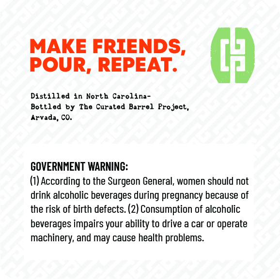
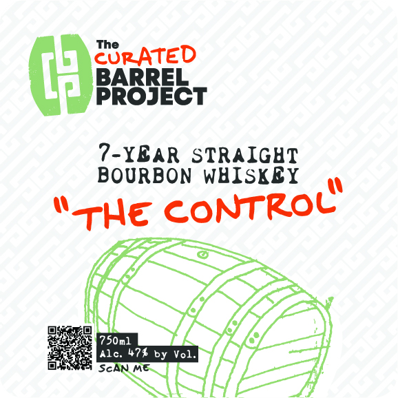

# TTB COLA Label Images - TTBID 26042001000263

**Brand Name:** THE CURATED BARREL PROJECT

**Fanciful Name:** THE CONTROL

**Issue Date:** 02/20/2026

**Origin Code:** 13

**Product Class/Type:** 101

**Source:** [TTB Public COLA Registry](https://ttbonline.gov/colasonline/viewColaDetails.do?action=publicFormDisplay&ttbid=26042001000263)

## Label Images

### Back Label

### Front Label

## Extracted Label Text

*Text extracted via OCR - may contain errors*

### Back Label

MAKE FRIENDS,

POUR, REPEAT.

Distilled in North Carolina-

Bottled by The Curated Barrel Project,

Arvada, CO.

GOVERNMENT WARNING:

(1) According to the Surgeon General, women should not

drink alcoholic beverages during pregnancy because of

the risk of birth defects. (2) Consumption of alcoholic

beverages impairs your ability to drive a car or operate

machinery, and may cause health problems.

### Front Label

CoRATED
BARREL
PROJECT

?-YBAR STRAIGHT
BOURBON WHISKBY

“He CONTROL
