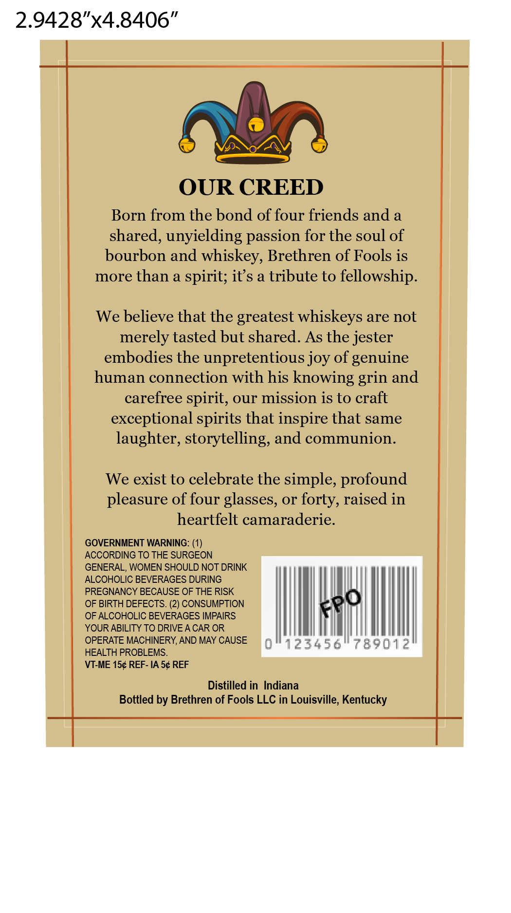

# TTB COLA Label Images - TTBID 26042001000406

**Brand Name:** BRETHREN OF FOOLS

**Issue Date:** 03/02/2026

**Origin Code:** 22

**Product Class/Type:** 101

**Source:** [TTB Public COLA Registry](https://ttbonline.gov/colasonline/viewColaDetails.do?action=publicFormDisplay&ttbid=26042001000406)

## Label Images

### Label 1

### Label 2

## Extracted Label Text

*Text extracted via OCR - may contain errors*

**Detected Age:** 8 Years

### Label 1

3.5"x6.25”

Brethren of
Fools

Ulbiskey Company
Bourbon Whiskey
Barrel Proof
750 ML

—- Aged 8 Years —-

Batch No. Proof ALC/VOL Bottle #
1 110 55% 1/100

### Label 2

2.9428"x4.8406"

©

VONZN ©

OUR CREED

Born from the bond of four friends and a

shared, unyielding passion for the soul of

bourbon and whiskey, Brethren of Fools is

more than a spirit; it’s a tribute to fellowship.

We believe that the greatest whiskeys are not

merely tasted but shared. As the jester

embodies the unpretentious joy of genuine

human connection with his knowing grin and

carefree spirit, our mission is to craft

exceptional spirits that inspire that same

laughter, storytelling, and communion.

We exist to celebrate the simple, profound

pleasure of four glasses, or forty, raised in

heartfelt camaraderie.

GOVERNMENT WARNING: (1)

ACCORDING TO THE SURGEON

GENERAL, WOMEN SHOULD NOT DRINK

ALCOHOLIC BEVERAGES DURING

PREGNANCY BECAUSE OF THE RISK

OF BIRTH DEFECTS. (2) CONSUMPTION

OF ALCOHOLIC BEVERAGES IMPAIRS

YOUR ABILITY TO DRIVE A CAR OR

Lil

4

OPERATE MACHINERY, AND MAY CAUSE

)

12345

Ls

0

HEALTH PROBLEMS.

VT-ME 15¢ REF- IA 5¢ REF

Distilled in Indiana

Bottled by Brethren of Fools LLC in Louisville, Kentucky
