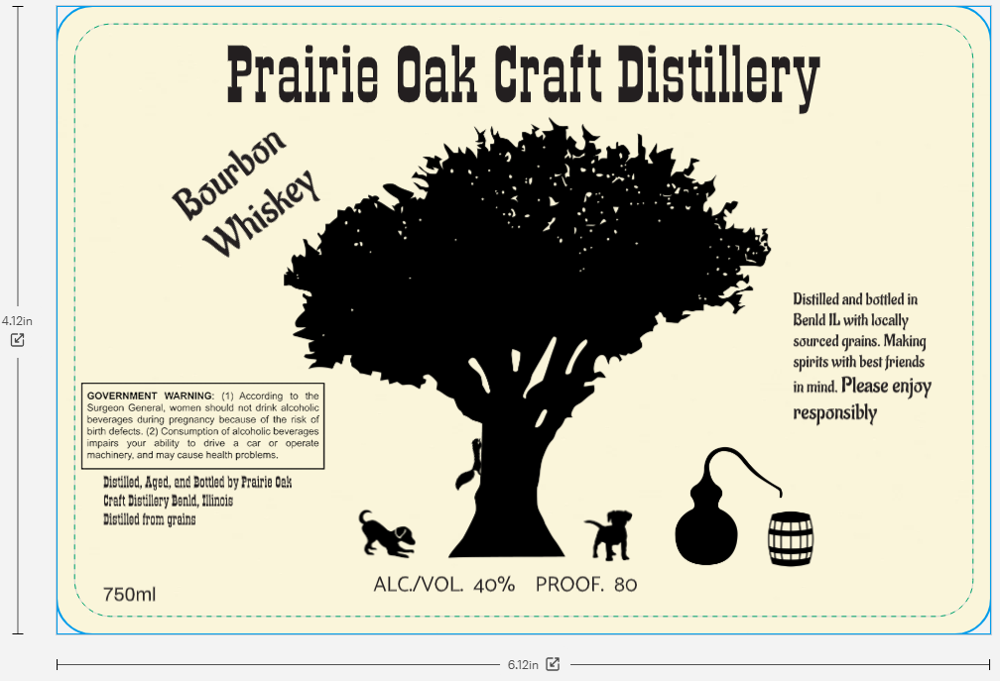

# TTB COLA Label Images - TTBID 26042001000487

**Brand Name:** PRAIRIE OAK CRAFT DISTILLERY

**Issue Date:** 02/12/2026

**Origin Code:** 04

**Product Class/Type:** 141

**Source:** [TTB Public COLA Registry](https://ttbonline.gov/colasonline/viewColaDetails.do?action=publicFormDisplay&ttbid=26042001000487)

## Label Images

### Label 1

## Extracted Label Text

*Text extracted via OCR - may contain errors*

### Label 1

TT

ooo

Prairie Oak Craft Distillery

oe

“ir

we

Ro

Distilled and bottled in

in

Benld IL with locally

sourced grains. Making

spivits with best friends

ac

war

no

VSL

inmind, Please enjoy

responsibly

machine

nd may

bem:

iged, end

y Praiie Oak

zi

lod from grat

Re

é:

PROOF. 80

750m!

ALC/VOL. 40%

Se

ee

L
