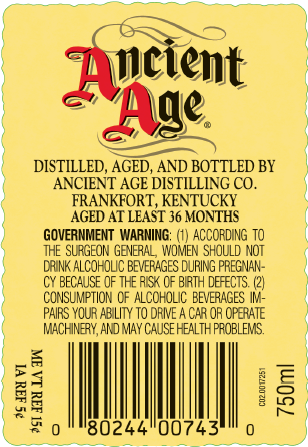
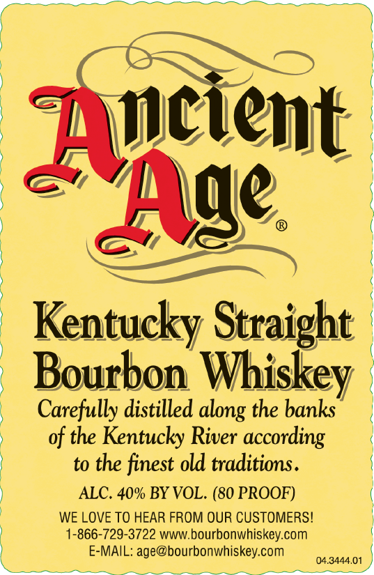

# TTB COLA Label Images - TTBID 26042001000539

**Brand Name:** ANCIENT AGE

**Issue Date:** 02/12/2026

**Origin Code:** 22

**Product Class/Type:** 101

**Source:** [TTB Public COLA Registry](https://ttbonline.gov/colasonline/viewColaDetails.do?action=publicFormDisplay&ttbid=26042001000539)

## Label Images

### Back Label

### Front Label

## Extracted Label Text

*Text extracted via OCR - may contain errors*

### Back Label

er:

ayneient

ae

DISTILLED, AGED, AND BOTTLED BY

ANCIENT AGE DISTILLING CO.

AGED AT LEAST 36 MONTHS:

FRANKFORT, KENTUCKY

GOVERNMENT WARNING: (1) ACCORDING T0

THE SURGEON GENERAL, WOMEN SHOULD NOT

DRINK ALCOHOLIC BEVERAGES DURING PREGNAN-

CY BECAUSE OF THE AISK OF BIRTH DEFECTS. (2)

CONSUMPTION OF ALCOHOLIC BEVERAGES IM

PAIRS YOUR ABILITY TO DRIVE A CAR OR OPERATE

MACHINERY, AND MAY CAUSE HEALTH PROBLEMS,

ei

|

Bz

oS

13024400743

oe

### Front Label

CE. Be — CR eae ae
|
| |
“‘Tneient
S44 {
) ca
, EY
oe
) Mt) (
| yy |
le ime EA
| 9 |
V4 ) © |
Kentucky Straight
®
- Bourbon Whiskey
Carefully distilled along the banks |
of the Kentucky River according
to the finest old traditions.
) ALC. 40% BY VOL. (80 PROOF) (
| WE LOVE TO HEAR FROM OUR CUSTOMERS!
) 1-866-729-3722 www.bourbonwhiskey.com {
E-MAIL: age@bourbonwhiskey.com onan |
ee a ee a, ern Saige tte ameee
