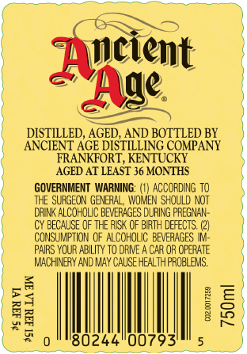
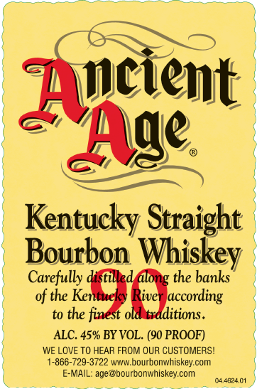

# TTB COLA Label Images - TTBID 26042001000544

**Brand Name:** ANCIENT AGE

**Issue Date:** 02/13/2026

**Origin Code:** 22

**Product Class/Type:** 101

**Source:** [TTB Public COLA Registry](https://ttbonline.gov/colasonline/viewColaDetails.do?action=publicFormDisplay&ttbid=26042001000544)

## Label Images

### Back Label

### Front Label

## Extracted Label Text

*Text extracted via OCR - may contain errors*

### Back Label

wien

Fut.

DISTILLED, aoe AND BOTTLED B'

SNCENT ‘AGE DISTILLING CoP

iD ATLEAST 36 MONT

GOVERNMENT WARNING: (1) ACCORDING 10

THE SURGEON GENERAL, WOMEN SHOULD NOT

DRINK ALCOHOLIC BEVERAGES DURING PREGNAN-

CY BECAUSE OF THE RISK OF BIRTH DEFECTS. (2)

CONSUMPTION OF ALCOHOLIC BEVERAGES IV

PAIRS YOUR ABILITY TO DRIVE A CAR OR OPERATE

MACHINERY AND MAY CAUSE HEALTH PROBLEMS.

Pas)

=

Bz

8

#2

0244"00793'

### Front Label

=>)

y|

bm

Ase

Kentucky Straight

§

5

Bourbon Whiskey

Carefully

the banks

act

of the

cording

to the

HO

itions.

)

ALC. 45% BY VOL. (90 PROOF)

WE LOVE TO HEAR FROM OUR CUSTOMERS!

1-866-729-3722 www.bourbonwhiskey.com.

E-MAIL: age@bourbonwhiskey.com

ee

ee

ras
