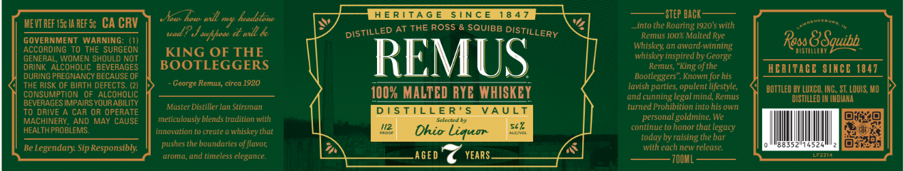

# TTB COLA Label Images - TTBID 26042001000759

**Brand Name:** REMUS

**Issue Date:** 02/12/2026

**Origin Code:** 29

**Product Class/Type:** 142

**Source:** [TTB Public COLA Registry](https://ttbonline.gov/colasonline/viewColaDetails.do?action=publicFormDisplay&ttbid=26042001000759)

## Label Images

### Label 1

### Label 2

## Extracted Label Text

*Text extracted via OCR - may contain errors*

### Label 1

_— .  —

HMw will my headitine HERITAGE SINCE 1847 —sTEP bck —— —
evra ew nerse CA CRV J “5 Wan Lie; [s/ pigtituED ATTHE ROSS & SQUIB DISTiLLemy 4] Im the Roaring 20th Soe
GOVERNMENT WARNING: (1) } a ea Rese BSgquib
ACCORDING TO THE SURGEON KING OF THE iste, an award-winning misTHTCERY
GENERAL WOMEN SHOULD NOT ( whiskey inspired by George JJ _'SUWT™T*_
DRINK ALCOHOLIC BeveRaces || BOOTLEGGERS Remus, “King of the HERITAGE SINCE 1847

d DURING PREGNANCY BECAUSE OF Ce pe 4 Bootleggers”. Known for his | era
THE RISK OF BIRTH DEFECTS. (2) joorge Hemme, circe. jonny MAITEN DYE WHICKEY lavish parties, opulent lifestyle,
CONSUMPTION OF ALcoHOLiC ff 100% MALTED RYE WHISKEY aadcufming egatindencrees POT Lee wc. sc Anu, HO
BEVERAGES IMPAIRS YOUR ABILITY OO . :.
PE DHHE Meenieaiteod ‘Master Distiller lan Stirsman DISTILLER’S VAULT ‘turned Prohibition into his own _—
MACHINERY, AND MAY CAUSE |} meticulously blends tradition with Selected b - personal goldmine. We ereeio}
: ; ch continue to honor tha legacy Raz

HEALTH PROBLEMS innovation to create a whiskey that "2 Ohio Liquor Xk Lettre Bare
paar ushes the boundaries of flavor, today by raising the bar Oras
Be Legendary sip Responsibly. |] P : ra with each new release 925

‘aroma, and timeless elegance. AGED YEARS. esa ten ane

### Label 2

ROSS & SQUIBB DISTILLERY

+

ROSS & SQUIBB DISTILLERY

+
