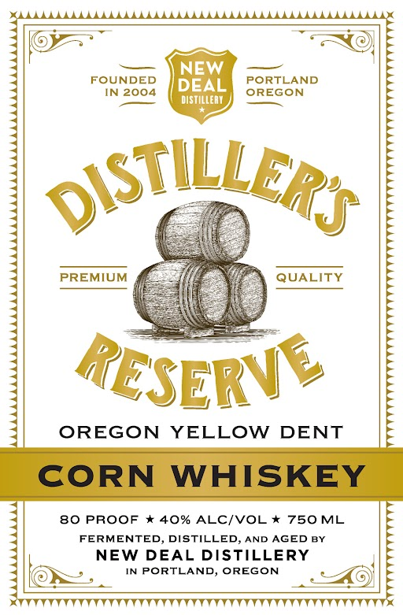

# TTB COLA Label Images - TTBID 26042001000845

**Brand Name:** NEW DEAL DISTILLERY

**Fanciful Name:** DISTILLER'S RESERVE CORN WHIKSEY

**Issue Date:** 02/17/2026

**Origin Code:** 38

**Product Class/Type:** 143

**Source:** [TTB Public COLA Registry](https://ttbonline.gov/colasonline/viewColaDetails.do?action=publicFormDisplay&ttbid=26042001000845)

## Label Images

### Front Label

## Extracted Label Text

*Text extracted via OCR - may contain errors*

### Front Label

FOUNDED
IN 2004

PREMIUM

OREGON YELLOW DENT

Weeveuverevevee

CORN WHISKEY

80 PROOF * 40% ALC/VOL * 750 ML E
FERMENTED, DISTILLED, AND AGED BY

NEW DEAL DISTILLERY q
LE, INPORTLAND, OREGON = Ol);

VVVVVVVYVYVVVVVYVVYVYVYVVYVVYVVVVVYYVYYYVYTYY YY
