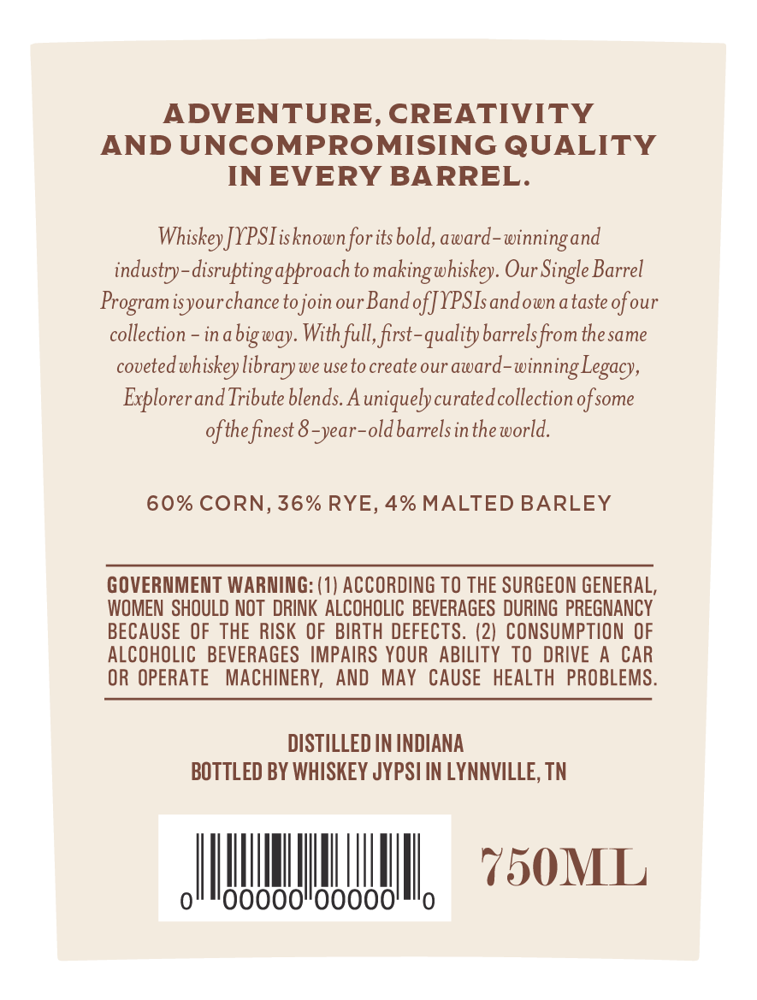
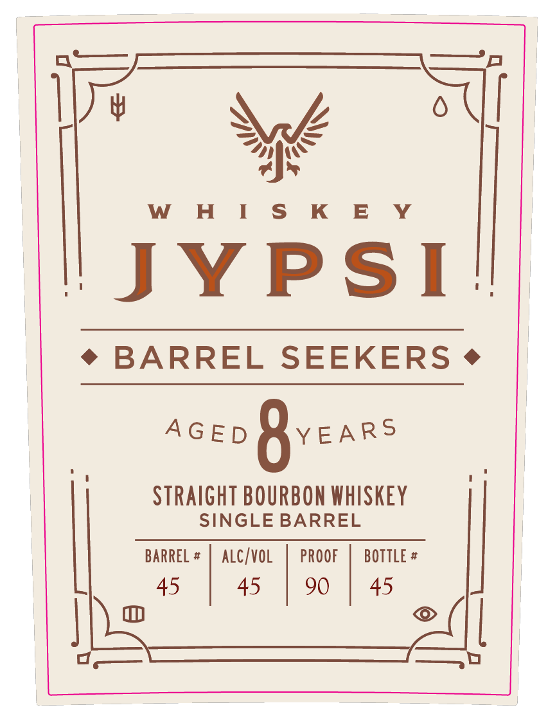

# TTB COLA Label Images - TTBID 26042001000889

**Brand Name:** WHISKEY JYPSI

**Fanciful Name:** BARREL SEEKERS

**Issue Date:** 02/12/2026

**Origin Code:** 43

**Product Class/Type:** 101

**Source:** [TTB Public COLA Registry](https://ttbonline.gov/colasonline/viewColaDetails.do?action=publicFormDisplay&ttbid=26042001000889)

## Label Images

### Back Label

### Front Label

### Label 3

## Extracted Label Text

*Text extracted via OCR - may contain errors*

*1 image(s) excluded: text did not meet readability threshold*

### Back Label

ADVENTURE, CREATIVITY

AND UNCOMPROMISING QUALITY

IN EVERY BARREL.

Whiskey ]YPSIisknown for its bold, award-winning and

industry-disrupting approach to making whiskey. Our Single Barrel

Programisyour chance to join our Band of J YPSIs andown a taste of our

collection - ina big way. With full, first-quality barrels from thesame

coveted whiskey library we use to create our award-winning Legacy,

Explorer and Tribute blends. A uniquely curated collection of some

of the finest 8-year-old barrels in the world.

60% CORN, 36% RYE, 4% MALTED BARLEY

GOVERNMENT WARNING: (1) ACCORDING TO THE SURGEON GENERAL,

WOMEN SHOULD NOT DRINK ALCOHOLIC BEVERAGES DURING PREGNANCY

BECAUSE OF THE RISK OF BIRTH DEFECTS. (2) CONSUMPTION OF

ALCOHOLIC BEVERAGES IMPAIRS YOUR ABILITY TO DRIVE A CAR

OR OPERATE MACHINERY, AND MAY CAUSE HEALTH PROBLEMS.

DISTILLED IN INDIANA

BOTTLED BY WHISKEY JYPSI IN LYNNVILLE, TN

AURILN, 50x0

### Front Label

Y\yé i

w HIS K E Y

Cite,

YPS

Stel

¢ BARREL * BARREL SEEKERS. +

Acen Qvears

SUT all BOURBON Use

GLE BARRE

BARREL #

ALC/VOL

PROOF

BOTTLE #

|

45

45

90

45

|
