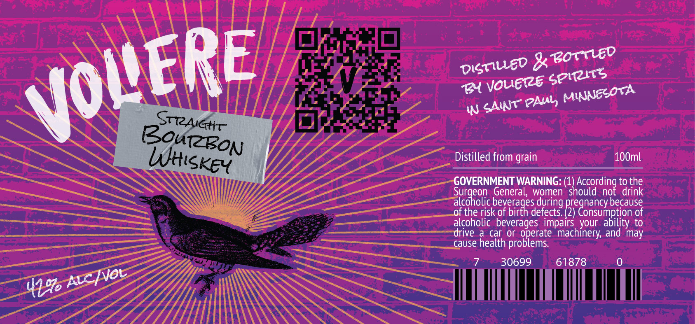

# TTB COLA Label Images - TTBID 26042001000926

**Brand Name:** VOLIERE

**Issue Date:** 02/13/2026

**Origin Code:** 27

**Product Class/Type:** 101

**Source:** [TTB Public COLA Registry](https://ttbonline.gov/colasonline/viewColaDetails.do?action=publicFormDisplay&ttbid=26042001000926)

## Label Images

### Label 1

## Extracted Label Text

*Text extracted via OCR - may contain errors*

### Label 1

Distilled from grain 100ml

OVERNMENT WARNING: (1) Accor, tothe
seca General, women should not drink
See, olic beverages during feanancy.becallse
Ol the risk of bi defects (2)
.

( onsumption of
coholic beverages impairs your ability
ive a caf or operate machinery, and may
use health problems.

7 50099)

z —— alcoh

<2 a
CO EES
aE

SS

61878 0
