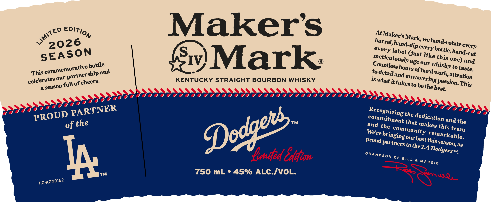
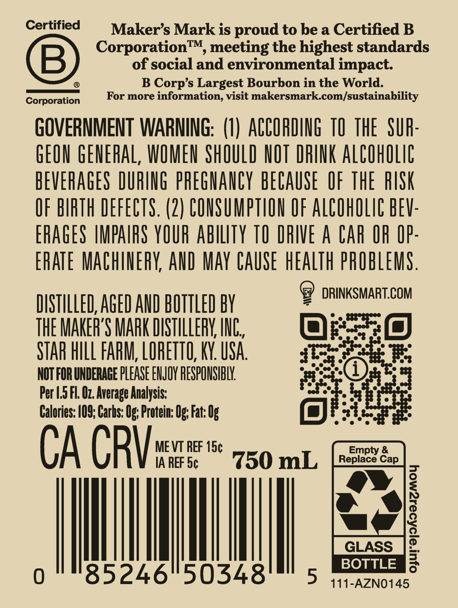

# TTB COLA Label Images - TTBID 26043001000077

**Brand Name:** MAKER'S MARK

**Issue Date:** 02/12/2026

**Origin Code:** 22

**Product Class/Type:** 101

**Source:** [TTB Public COLA Registry](https://ttbonline.gov/colasonline/viewColaDetails.do?action=publicFormDisplay&ttbid=26043001000077)

## Label Images

### Label 1

### Label 2

## Extracted Label Text

*Text extracted via OCR - may contain errors*

### Label 1

9 At Maker’, Mark, we hand-rotate every
[ barrel, hand-dip every bottle, hand-cut
every labe] (Gust like this ne) ang
meticulously 4ge our Whisky to taste,
Countless hours of hard Work, attention
ED EDIT), "y ® to detail ang meWavering passion This
ws 26 Srv) iswhat it takes to he the best,
N
v 20 HISKY
NW
SEASON ; Fo cnr eunse RE)...
sve bottle UCK 90 @
emorative He and KENT DIDODODIDOIADA Recognizing the dedication and the
4s comm artners: DDODODOO °“Ommitment that Makes thi, team
Thi our Pp neers. 9DOe :
Jebrates full of ¢! VOODOO and the Sommunity remarkable,
& aseason 909099 ™ ron egret ger See
ak id ER Proud Partners to the, 4 Dodgers,
?
?? N
5) p) ? ? UD PART SRANDSon OF BILL & MARGIE
?
,@ @ PRO of the
OL.
% ALC./V
Ip 750 mL * 45% 7
™
162
110-AZNO

### Label 2

Certified

Maker’s Mark is proud to be a Certified B

Corporation™, meeting the highest standards

of social and environmental impact

©

®

B Corp’s Largest Bourbon in the World.

Corporati

For more information, visit makersmark.com/sustainability

GOVERNMENT WARNING: (1) ACCORDING 10 THE SUR

GEON GENERAL, WOMEN SHOULD NOT DRINK ALCOHOLIC

BEVERAGES DURING PREGNANCY BECAUSE OF THE RISK

OF BIRTH DEFECTS. (2) CONSUMPTION OF ALCOHOLIC BEV

ERAGES IMPAIRS YOUR ABILITY TO DRIVE A CAR OR OP

ERATE MACHINERY, AND MAY CAUSE HEALTH PROBLEMS

) DRINKSMART.COM

DISTILLED, AGED AND BOTTLED BY

THE MAKER'S MARK DISTILLERY, INC

Ore

STAR HILL FARM, LORETO, KY. USA

tay

NOT FOR UNDERAGE PLEASE ENJOY RESPONSIBLY.

Per 1.5 Fl. O7. Average Analysis:

Calories: 109; Carhs: Og; Protein: Og; Fat: 0

ant

CA CRY

MEVT REF 15¢

IA REF 5¢

il mL

i

Mh

BOTTLE

.) 111-AZN0145
