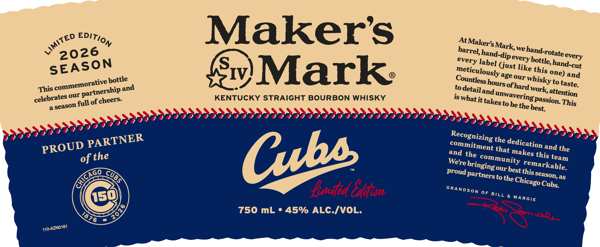
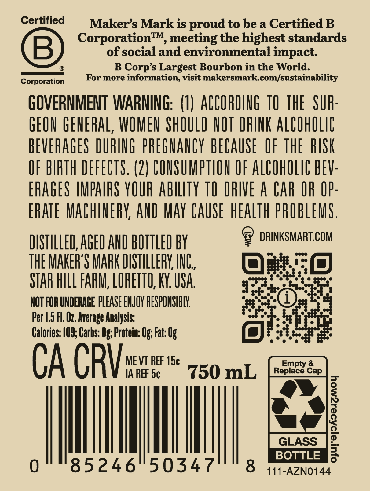

# TTB COLA Label Images - TTBID 26043001000079

**Brand Name:** MAKER'S MARK

**Issue Date:** 02/12/2026

**Origin Code:** 22

**Product Class/Type:** 101

**Source:** [TTB Public COLA Registry](https://ttbonline.gov/colasonline/viewColaDetails.do?action=publicFormDisplay&ttbid=26043001000079)

## Label Images

### Label 1

### Label 2

## Extracted Label Text

*Text extracted via OCR - may contain errors*

### Label 1

wer? EDIT),

Maker's

At Maker

ark,

2026

el, h d-

» We han tate

every

TY bottle, han

sEASO

every labe Gust I

ike thj

d-cut

meticulous] ageo

ne) a d

ottle

untless ho

ur Whisky

to taste

This co

immemorative P

axtnership

Sw) Mark:

todetailan

celebrates ©

KENTUCKY STRAIGHT BOURBON WHISKY

averin,

Wor] attention

0 f cheers

is What it takes to

beth

8 Passion Thi

a season

© best,

eageee

77 00 OOOO OOOO OEE EE EE IE EEEEEEIE III IIE IEEE III IAOEE ST ha dd)

099

meaeeee

Recognizing the das:

Cl CCC OR

RTNER

Commitme

ROUD PA

and he

nt that m

1Cation and the

of the

We

mm ni

akes thi, team

Tre brin;

ey “markable

<u

CY,

Proud Parin

'S Our b

St

Ry,

seme

Ss

TS to the Chi

S Season, as

Cago Cub

“ated Elin

SRANDsSon OF BILL & MARGIE

)

a a

750 mL ° 45% ALC./VOL.

<e>

(ed

410-AZNO161

### Label 2

Certified

Maker’s Mark is proud to be a Certified B

Corporation™, meeting the highest standards

of social and environmental impact

©

®

B Corp’s Largest Bourbon in the World.

Corporati

For more information, visit makersmark.com/sustainability

GOVERNMENT WARNING: (1) ACCORDING 10 THE SUR

GEON GENERAL, WOMEN SHOULD NOT DRINK ALCOHOLIC

BEVERAGES DURING PREGNANCY BECAUSE OF THE RISK

OF BIRTH DEFECTS. (2) CONSUMPTION OF ALCOHOLIC BEV

ERAGES IMPAIRS YOUR ABILITY TO DRIVE A CAR OR OP

ERATE MACHINERY, AND MAY CAUSE HEALTH PROBLEMS

® DRINKSMART.COM

DISTILLED, AGED AND BOTTLED BY

THE MAKER'S MARK DISTILLERY, INC

=: (s)

STAR HILL FARM, LORETTO, KY. USA

qm one

NOT FOR UNDERAGE PLEASE ENJOY RESPONSIBLY.

Per 1.5 Fl. O7. Average Analysis:

Calories: 109; Carhs: Og; Protein: Og; Fat: 0

ait

CA CRY

MEVT REF 15¢

IA REF 5¢

750 mL

|

|

|

|

85246 50347

BOTTLE

8 444-azno144
